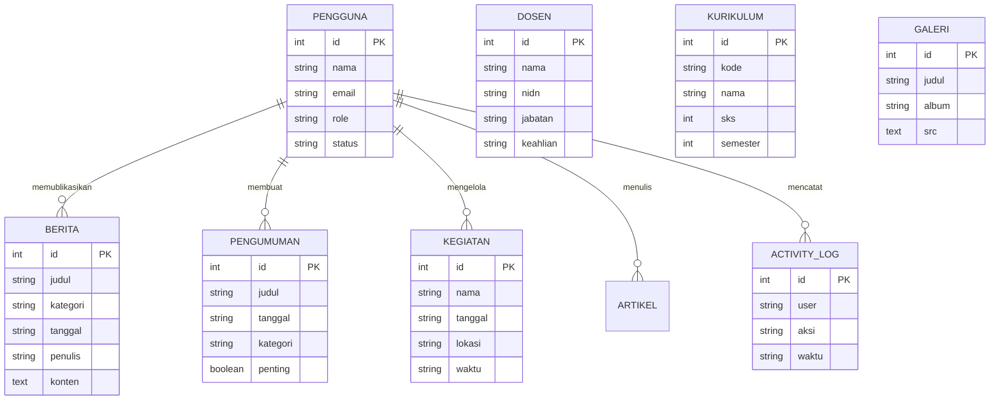
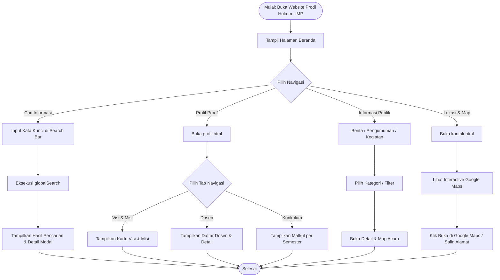
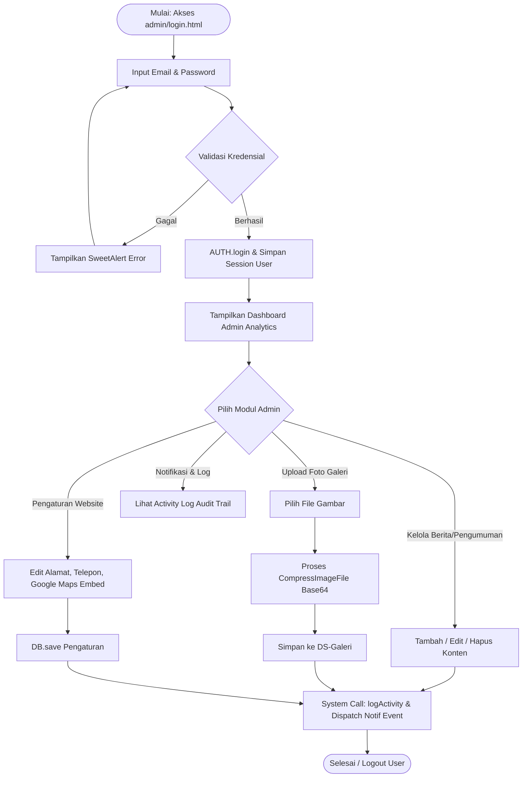

# DOKUMENTASI SISTEM & SPESIFIKASI FINAL
## Website Profil & Sistem Informasi Program Studi Hukum
### Universitas Muhammadiyah Papua (UMP)

> Dokumen acuan resmi arsitektur sistem, spesifikasi basis data, **Entity Relationship Diagram (ERD)**, **Data Flow Diagram (DFD Level 0 & Level 1)**, dan **Flowchart Sistem** untuk Website Profil & Panel Manajemen Administrasi Akademik Program Studi Hukum UMP.

---

## 📋 DAFTAR ISI
1. [Ringkasan Proyek & Arsitektur System](#1-ringkasan-proyek--arsitektur-system)
2. [Teknologi & Design System](#2-teknologi--design-system)
3. [Struktur Berkas Proyek (35 Halaman HTML)](#3-struktur-berkas-proyek)
4. [Spesifikasi Model Data & ERD (Entity Relationship Diagram)](#4-spesifikasi-model-data--erd)
5. [Data Flow Diagram (DFD Level 0 & Level 1)](#5-data-flow-diagram-dfd)
6. [Flowchart Sistem (Public & Admin Workflow)](#6-flowchart-sistem)
7. [Fitur Utama & Panduan Pengoperasian](#7-fitur-utama--panduan-pengoperasian)

---

## 1. 🏛️ RINGKASAN PROYEK & ARSITEKTUR SYSTEM

Website Program Studi Hukum Universitas Muhammadiyah Papua dirancang sebagai platform informasi publik dan portal manajemen administrasi akademik yang berbasis **Single Page State Architecture** dengan mesin penyimpanan lokal terenkapsulasi (**LocalStorage Engine with Automatic Resilient Recovery**).

### Arsitektur Utama Sistem:
```
                                ┌────────────────────────────────────────────────────────┐
                                │       PENGUNJUNG PUBLIK / MAHASISWA / ALUMNI           │
                                └───────────────────────────┬────────────────────────────┘
                                                            │
                                                            ▼
                                ┌────────────────────────────────────────────────────────┐
                                │         FRONTEND PORTAL PUBLIK (18 HALAMAN)            │
                                │  • Navigation, Global Search & Interactive Maps        │
                                │  • News, Announcements, Events, Documents & Gallery    │
                                │  • Profil Prodi, Dosen, Kurikulum, Alumni & Prestasi   │
                                └───────────────────────────┬────────────────────────────┘
                                                            │
                                                            ▼
┌─────────────────────────────────────────┐     ┌────────────────────────────────────────┐
│      SUPER ADMIN / EDITOR / OPERATOR    │ ──► │     ADMIN PANEL PORTAL (17 HALAMAN)    │
│  • Authentication & Role Access Control │     │  • Dashboard Analytics & Quick Stats   │
│  • Full CRUD Content & User Management  │     │  • Content Management (News, Dosen...) │
│  • Reactive Notif & Activity Logging    │     │  • System Settings, Backup & Database  │
└─────────────────────────────────────────┘     └───────────────────┬────────────────────┘
                                                                    │
                                                                    ▼
                                ┌────────────────────────────────────────────────────────┐
                                │     PERSISTENCE & REACTION ENGINE (app.js DB Engine)   │
                                │  • LocalStorage Namespace: DB.NS ('prodihukum_')       │
                                │  • Resilient Recovery & Automatic Image Compression    │
                                │  • Alpine.js Reactive State Sync & Event Bus           │
                                └────────────────────────────────────────────────────────┘
```

---

## 2. 🎨 TEKNOLOGI & DESIGN SYSTEM

| Layer | Teknologi | Fungsi & Peran |
|---|---|---|
| **Struktur Semantik** | HTML5 | Menggunakan tag HTML5 semantik (`header`, `nav`, `aside`, `main`, `section`, `article`, `footer`). |
| **Grid & Komponen** | Bootstrap 5.3.3 | Menyediakan sistem grid responsif, modal backdrop, dan utilitas pendukung layout. |
| **Styling & Neumorphism** | Tailwind CSS + Custom CSS (`style.css`) | Antarmuka Neumorphic modern (`neu-raised`, `neu-pressed`, `neu-flat`, `neu-btn`), warna *Royal Blue* (`#2A4E9E`), *Deep Navy* (`#0B1F3A`), dan *Gold Accent* (`#D4AF37`). |
| **Reaktivitas Engine** | Alpine.js 3.14.8 | Manajemen state reaktif tanpa halaman reload, filter langsung, modal state, binding data, serta integrasi hash URL. |
| **Notifikasi Interaktif** | SweetAlert2 v11 | Alert konfirmasi penghapusan, notifikasi aksi sukses/gagal, dan alert aktivitas sistem. |
| **Media & Peta** | Google Maps API Iframe | Peta lokasi kampus interaktif dengan fitur `touch-action: pan-y` pasif untuk kompatibilitas layar sentuh. |

---

## 3. 📁 STRUKTUR BERKAS PROYEK

Proyek ini terdiri dari **35 halaman HTML utama** yang terbagi atas 18 Halaman Publik dan 17 Halaman Admin:

```
Perancangan-Dan-Pengembangan-website-profil-UMP-/
├── index.html                  # Beranda Utama (Hero Law Theme, Stats, Agenda, Map)
├── profil.html                 # Profil Prodi (Tab-based: Visi, Misi, Sejarah, Tujuan, Struktur)
├── dosen.html                  # Daftar Dosen & Pengajar (Filter Jabatan & Pencarian)
├── kurikulum.html              # Kurikulum & Struktur Mata Kuliah per Semester
├── berita.html                 # Indeks Berita Prodi & Kategori
├── pengumuman.html             # Indeks Pengumuman & Lampiran Berkas
├── kegiatan.html               # Indeks Agenda & Kegiatan Mendatang
├── artikel.html                # Indeks Artikel Hukum & Jurnal
├── prestasi.html               # Galeri Prestasi Mahasiswa, Dosen & Alumni
├── alumni.html                 # Direktori Alumni & Tracer Study
├── galeri.html                 # Galeri Foto Kegiatan & Album
├── dokumen.html                # Pusat Unduhan Dokumen Akademik & Formulir
├── kontak.html                 # Kontak, Form Pesan & Peta Lokasi Kampus Interaktif
├── detail-berita.html          # Detail Berita & Berita Terkait
├── detail-pengumuman.html      # Detail Pengumuman & Tombol Unduh Lampiran
├── detail-kegiatan.html        # Detail Kegiatan & Peta Lokasi Acara
├── detail-artikel.html         # Detail Artikel Hukum & Penulis
├── detail-galeri.html          # Detail Album Foto & Slideshow
│
├── admin/                      # PORTAL ADMINISTRASI AKADEMIK
│   ├── login.html              # Halaman Login Admin (Law Court Aesthetic)
│   ├── dashboard.html          # Dashboard Analytics & Quick Action
│   ├── profil-prodi.html       # Management Visi, Misi, & Sejarah Prodi
│   ├── dosen.html              # CRUD Data Dosen & NIDN
│   ├── kurikulum.html          # CRUD Mata Kuliah & SKS
│   ├── berita.html             # CRUD Berita & Publisher
│   ├── pengumuman.html         # CRUD Pengumuman & Lampiran
│   ├── kegiatan.html           # CRUD Agenda Kegiatan & Lokasi
│   ├── prestasi.html           # CRUD Prestasi & Penghargaan
│   ├── artikel.html            # CRUD Artikel Hukum & Penulis
│   ├── galeri.html             # CRUD Foto Galeri & Album (Fix Modal & Compression)
│   ├── dokumen.html            # CRUD Berkas & Dokumen Akademik
│   ├── alumni.html             # CRUD Data Alumni & Pekerjaan
│   ├── pengguna.html           # CRUD Akun Pengguna & Hak Akses (Role)
│   ├── aktivitas.html          # Activity Log & Jejak Audit Sistem
│   ├── pengaturan.html         # Pengaturan Website, Map Embed, Backup/Restore JSON
│   └── activity-log.html       # Log Aktivitas Notifikasi
│
└── assets/                     # ASET SISTEM & STYLESHEET
    ├── css/
    │   ├── tailwind.min.css    # Tailwind Utility Build
    │   └── style.css           # Custom Neumorphism Styles & Law Visual Themes
    ├── js/
    │   └── app.js              # Database Engine, State Store, Component Functions
    └── image/
        ├── logo-ump.png        # Logo Resmi UMP
        ├── hero-law-bg.jpg     # Banner Visual Hukum & Timbangan Keadilan
        └── law-court-bg.jpg    # Banner Visual Gedung Peradilan
```

---

## 4. 🗄️ SPESIFIKASI MODEL DATA & ERD

Sistem menggunakan **16 Entitas Data Utama** yang terintegrasi secara relational melalui Kunci Utama (`id`) dan Kunci Asing (`foreign keys`):

```
                                  ┌────────────────────────┐
                                  │      PENGGUNA          │
                                  │ (Users/Administrator)  │
                                  └───────────┬────────────┘
                                              │
                    ┌─────────────────────────┼─────────────────────────┐
                    │ 1:N                     │ 1:N                     │ 1:N
                    ▼                         ▼                         ▼
          ┌───────────────────┐     ┌───────────────────┐     ┌───────────────────┐
          │      BERITA       │     │    PENGUMUMAN     │     │     KEGIATAN      │
          └───────────────────┘     └───────────────────┘     └───────────────────┘
                    │                         │                         │
                    └─────────────────────────┼─────────────────────────┘
                                              │ 1:N
                                              ▼
                                    ┌───────────────────┐
                                    │   ACTIVITY_LOG    │
                                    └───────────────────┘
```

### 4.1 Tabel Detail Entitas Data (Data Dictionary)

#### 1. Entitas `PENGGUNA` (Admin & User Accounts)
* **Deskripsi**: Menyimpan data akun pengelola dan hak akses admin.
* **Tabel Name**: `prodihukum_pengguna`

| Field | Tipe Data | Constraint | Keterangan |
|---|---|---|---|
| `id` | INTEGER | PRIMARY KEY, AUTO_INCREMENT | Identitas unik pengguna |
| `nama` | VARCHAR(100) | NOT NULL | Nama lengkap pengguna |
| `email` | VARCHAR(100) | UNIQUE, NOT NULL | Alamat email / username login |
| `role` | ENUM | 'Super Admin', 'Admin Prodi', 'Editor' | Hak akses pengguna |
| `status` | ENUM | 'Aktif', 'Nonaktif' | Status keaktifan akun |
| `avatar` | TEXT (BASE64) | NULLABLE | Foto profil pengguna |

#### 2. Entitas `BERITA` (News & Articles)
* **Deskripsi**: Menyimpan warta berita prodi.
* **Tabel Name**: `prodihukum_berita`

| Field | Tipe Data | Constraint | Keterangan |
|---|---|---|---|
| `id` | INTEGER | PRIMARY KEY | Identitas berita |
| `judul` | VARCHAR(255) | NOT NULL | Judul berita |
| `kategori` | VARCHAR(50) | NOT NULL | Kategori (Akademik, Prestasi, Event, dll) |
| `tanggal` | DATE / STRING | NOT NULL | Tanggal publikasi (YYYY-MM-DD) |
| `penulis` | VARCHAR(100) | NOT NULL | Nama penulis/editor |
| `excerpt` | TEXT | NOT NULL | Ringkasan berita |
| `konten` | LONGTEXT | NOT NULL | Isi artikel berita lengkap |
| `gambar` | TEXT (BASE64) | NULLABLE | Thumbnail gambar berita |
| `featured` | BOOLEAN | DEFAULT FALSE | Indikator berita utama di beranda |

#### 3. Entitas `DOSEN` (Faculty Lecturers)
* **Deskripsi**: Menyimpan data tenaga pengajar dan staf dosen.
* **Tabel Name**: `prodihukum_dosen`

| Field | Tipe Data | Constraint | Keterangan |
|---|---|---|---|
| `id` | INTEGER | PRIMARY KEY | Identitas dosen |
| `nama` | VARCHAR(150) | NOT NULL | Nama lengkap & gelar dosen |
| `nidn` | VARCHAR(30) | UNIQUE, NOT NULL | Nomor Induk Dosen Nasional |
| `jabatan` | VARCHAR(100) | NOT NULL | Jabatan akademik (Lektor Kepala, Dosen Tetap) |
| `keahlian` | VARCHAR(150) | NOT NULL | Bidang keahlian (Hukum Pidana, Hukum Perdata) |
| `email` | VARCHAR(100) | NULLABLE | Email institusi dosen |
| `foto` | TEXT (BASE64) | NULLABLE | Foto resmi dosen |

#### 4. Entitas `KURIKULUM` (Academic Courses)
* **Deskripsi**: Data mata kuliah prodi per semester.
* **Tabel Name**: `prodihukum_kurikulum`

| Field | Tipe Data | Constraint | Keterangan |
|---|---|---|---|
| `id` | INTEGER | PRIMARY KEY | Kode/ID mata kuliah |
| `kode` | VARCHAR(20) | UNIQUE, NOT NULL | Kode mata kuliah (HKM101) |
| `nama` | VARCHAR(150) | NOT NULL | Nama mata kuliah |
| `sks` | INTEGER | NOT NULL | Jumlah Bobot SKS |
| `semester` | INTEGER | NOT NULL (1 - 8) | Semester pengambilan |
| `jenis` | ENUM | 'Wajib', 'Pilihan' | Jenis mata kuliah |
| `deskripsi` | TEXT | NULLABLE | Silabus singkat mata kuliah |

#### 5. Entitas `PENGUMUMAN` (Announcements)
* **Tabel Name**: `prodihukum_pengumuman`
* **Fields**: `id` (PK), `judul`, `tanggal`, `kategori`, `konten`, `lampiran` (File Name), `penting` (Boolean).

#### 6. Entitas `KEGIATAN` (Events & Seminars)
* **Tabel Name**: `prodihukum_kegiatan`
* **Fields**: `id` (PK), `nama`, `tanggal`, `waktu`, `lokasi`, `penyelenggara`, `deskripsi`, `gambar`.

#### 7. Entitas `PRESTASI` (Achievements)
* **Tabel Name**: `prodihukum_prestasi`
* **Fields**: `id` (PK), `nama`, `kategori` ('Mahasiswa', 'Dosen', 'Alumni'), `peringkat`, `tingkat` ('Nasional', 'Internasional'), `tahun`, `deskripsi`, `foto`.

#### 8. Entitas `ARTIKEL` (Legal Publications & Journals)
* **Tabel Name**: `prodihukum_artikel`
* **Fields**: `id` (PK), `judul`, `penulis`, `tanggal`, `kategori`, `excerpt`, `konten`, `dibaca` (Integer Counter).

#### 9. Entitas `GALERI` (Photo Gallery)
* **Tabel Name**: `prodihukum_galeri`
* **Fields**: `id` (PK), `judul`, `album` ('Seminar', 'Wisuda', 'Praktikum', dll), `src` (Base64 Image).

#### 10. Entitas `DOKUMEN` (Academic Files)
* **Tabel Name**: `prodihukum_dokumen`
* **Fields**: `id` (PK), `nama`, `kategori` ('Pedoman', 'Formulir', 'SK'), `ukuran`, `tanggal`, `fileUrl`.

#### 11. Entitas `ALUMNI` (Alumni Directory)
* **Tabel Name**: `prodihukum_alumni`
* **Fields**: `id` (PK), `nama`, `angkatan`, `tahunLulus`, `pekerjaan`, `instansi`, `testimoni`, `foto`.

#### 12. Entitas `ACTIVITY_LOG` (Audit Trail)
* **Tabel Name**: `prodihukum_aktivitas`
* **Fields**: `id` (PK), `user` ('Admin Prodi'), `aksi`, `waktu` (Timestamp), `icon`.

#### 13. Entitas `NOTIFIKASI` (System Notifications)
* **Tabel Name**: `prodihukum_notifikasi`
* **Fields**: `id` (PK), `judul`, `pesan`, `waktu`, `read` (Boolean), `icon`.

#### 14. Entitas `PENGATURAN` (Website Configuration)
* **Tabel Name**: `prodihukum_pengaturan`
* **Fields**: `namaWebsite`, `deskripsi`, `email`, `telepon`, `alamat`, `mapEmbed`, `mapLink`, `koordinat`, `mahasiswaAktif`.

#### 15. Entitas `PROFIL` (Program Study Profile)
* **Tabel Name**: `prodihukum_profil`
* **Fields**: `namaProdi`, `akreditasi`, `skAkreditasi`, `visi`, `misi` (Array), `sejarah`, `tujuan` (Array).

#### 16. Entitas `STRUKTUR` (Organization Structure)
* **Tabel Name**: `prodihukum_struktur`
* **Fields**: `id` (PK), `nama`, `jabatan`, `foto`.

---

### 4.2 Diagram ERD (Entity Relationship Diagram - Mermaid)



---

## 5. 🔄 DATA FLOW DIAGRAM (DFD)

### 5.1 DFD Level 0 (Diagram Konteks / Context Diagram)

```
                 ┌────────────────────────────────────────────────────────┐
                 │                  PENGUNJUNG PUBLIK                     │
                 │          (Mahasiswa, Calon Mahasiswa, Alumni)          │
                 └───────────┬────────────────────────────────┬───────────┘
                             │                                ▲
               Form Pesan,   │                                │ Info Akademik, Berita,
               Search Query, │                                │ Dosen, Kurikulum, Peta,
               Filter Request│                                │ Unduhan Dokumen
                             ▼                                │
                 ┌────────────────────────────────────────────────────────┐
                 │                       PROSES 0.0                       │
                 │           SISTEM INFORMASI PRODI HUKUM UMP             │
                 └───────────┬────────────────────────────────┬───────────┘
                             ▲                                │
              Credential     │                                │ Dashboard Analytics,
              Login, Data    │                                │ Status Notifikasi,
              CRUD Update    │                                │ Activity Audit Log
                             │                                ▼
                 ┌────────────────────────────────────────────────────────┐
                 │                 ADMINISTRATOR / PENGELOLA              │
                 │             (Super Admin, Admin Prodi, Editor)         │
                 └────────────────────────────────────────────────────────┘
```

---

### 5.2 DFD Level 1 (Diagram Rinci Proses)

```
                             [ PENGUNJUNG PUBLIK ]
                                       │
            ┌──────────────────────────┼──────────────────────────┐
            │ Search / Filter Request  │ Submission Form          │ Request Document
            ▼                          ▼                          ▼
 ┌──────────────────────┐   ┌──────────────────────┐   ┌──────────────────────┐
 │     PROSES 1.0       │   │     PROSES 2.0       │   │     PROSES 3.0       │
 │   Pencarian &        │   │  Pesan & Hubungi     │   │  Unduh Dokumen &     │
 │   Browsing Informasi │   │      Kampus          │   │   Lampiran File      │
 └──────────┬───────────┘   └──────────┬───────────┘   └──────────┬───────────┘
            │ Data Feed                │ Log Messages             │ File Streaming
            ▼                          ▼                          ▼
 ┌────────────────────────────────────────────────────────────────────────────┐
 │                            DATA STORES (LocalStorage)                      │
 │  DS-1: Berita    DS-2: Dosen     DS-3: Kurikulum   DS-4: Kegiatan        │
 │  DS-5: Galeri    DS-6: Dokumen   DS-7: Pengumuman  DS-8: Activity Log    │
 └─────────────────────────────────────┬──────────────────────────────────────┘
                                       ▲
                                       │ Data CRUD Operations
                                       │
 ┌─────────────────────────────────────┴──────────────────────────────────────┐
 │     PROSES 4.0: Autentikasi & Manajemen Konten Admin (CRUD & Settings)     │
 └─────────────────────────────────────▲──────────────────────────────────────┘
                                       │ Login / Admin Commands
                             [ ADMINISTRATOR / ADMIN ]
```

---

## 6. 🔀 FLOWCHART SISTEM

### 6.1 Flowchart Pengunjung Publik (Public User Workflow)



---

### 6.2 Flowchart Administrator (Admin Panel Workflow)



---

## 7. 🚀 FITUR UTAMA & PANDUAN PENGOPERASIAN

### 7.1 Fitur Unggulan Sistem
1. **Interactive Google Maps Embed (`touch-action: pan-y`)**:
   Peta kampus interaktif yang lancar dioperasikan pada smartphone tanpa memblokir gesture scrolling halaman.
2. **Tab-Based Profil & Deep Link Hash**:
   Membuka bagian spesifik profil prodi (`#visi-misi`, `#struktur`, `#sejarah`) secara langsung dari URL hash.
3. **Resilient LocalStorage DB & Auto-Compression**:
   Gambar yang diunggah otomatis dikompres ke format ringan untuk menghemat kuota penyimpanan browser.
4. **Real-time Reactive Notification Dropdown**:
   Dropdown notifikasi dengan konfirmasi baca dan hapus instan tanpa refresh halaman.
5. **Mobile Navigation Neumorphic Menu**:
   Menu navigasi ponsel dengan bilah pencarian terpadu dan penanda indikator halaman aktif.

### 7.2 Cara Pengoperasian & Pengujian Lokal
1. **Menjalankan Proyek**:
   - Proyek ini murni berbasis HTML, CSS, dan JavaScript (*Client-Side Engine*).
   - Cukup buka file `index.html` langsung menggunakan peramban web (Chrome, Edge, Firefox, Safari) atau gunakan extension **Live Server** di VS Code / IDE.
2. **Akses Portal Admin**:
   - Buka halaman `admin/login.html` atau klik tombol **Portal Akademik** di header/footer.
   - Masukkan email misal: `admin@ump.ac.id` dan password sembarang untuk simulasi login admin.
3. **Uji Coba Fitur Backup & Restore Data**:
   - Masuk ke menu **Pengaturan** di Admin Panel untuk mengunduh backup basis data dalam format JSON atau memulihkan data bawaan awal.

---
*Dokumentasi ini disusun secara komprehensif sebagai acuan pengembangan ERD, DFD Level 1, dan Flowchart Sistem Program Studi Hukum Universitas Muhammadiyah Papua.*
