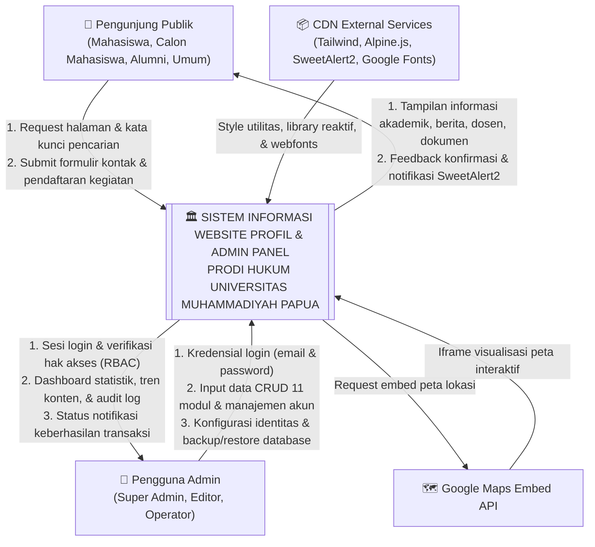
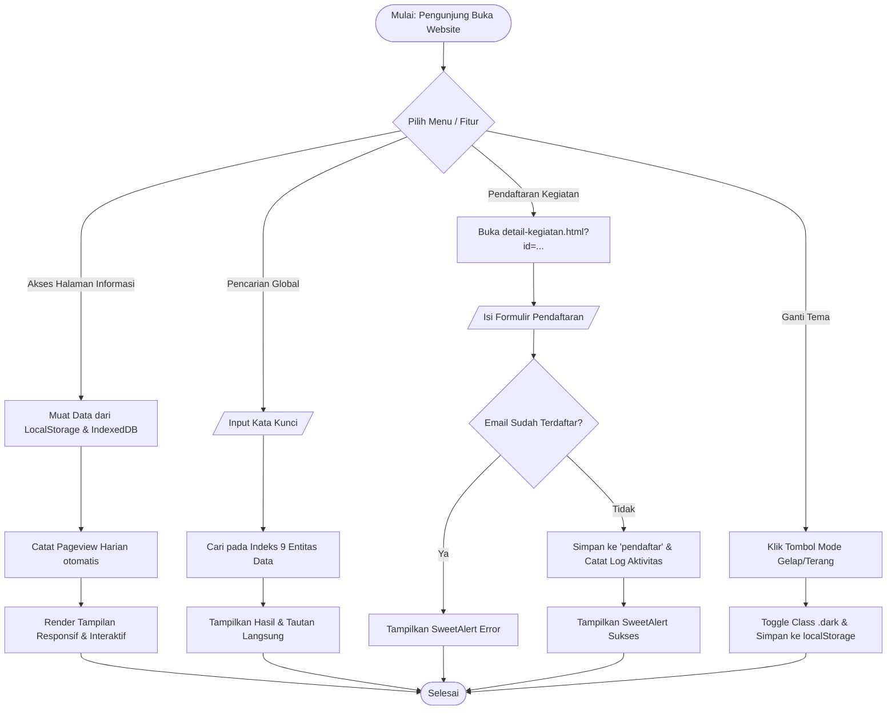
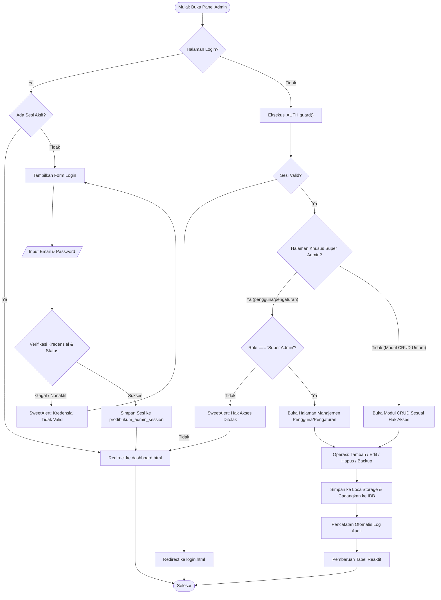

# 🏛️ DOKUMENTASI SISTEM & SPESIFIKASI FINAL (HASIL AUDIT)

## Website Profil & Panel Admin Program Studi Hukum — Universitas Muhammadiyah Papua (UMP)

> Dokumen ini adalah **versi final hasil audit menyeluruh** terhadap seluruh berkas proyek (`36 berkas HTML`, `assets/js/app.js`, `assets/css/style.css`, `package.json`, `tailwind.config.js`, `sitemap.xml`, serta dokumen diagram pendukung). Seluruh angka, daftar halaman, entitas data, ERD, DFD Level 0/1, Sequence Diagram, dan Flowchart Sistem di bawah ini **diverifikasi langsung dari kode sumber sesungguhnya**, sehingga dijamin 100% konsisten dan akurat dengan implementasi yang berjalan.

---

## 📋 DAFTAR ISI

1. [Ringkasan Proyek & Arsitektur Sistem](#1-ringkasan-proyek-arsitektur-sistem)
2. [Teknologi & Design System](#2-teknologi-design-system)
3. [Struktur Berkas Proyek (36 Halaman HTML)](#3-struktur-berkas-proyek)
4. [Spesifikasi Model Data & ERD](#4-spesifikasi-model-data-erd)
5. [Data Flow Diagram (DFD Level 0 & Level 1)](#5-data-flow-diagram-dfd)
6. [Flowchart Sistem](#6-flowchart-sistem)
7. [Hasil Audit & Perbaikan (Log Perbaikan)](#7-hasil-audit-perbaikan)
8. [Fitur Utama & Panduan Pengoperasian](#8-fitur-utama-panduan-pengoperasian)
9. [Dokumentasi Diagram & Viewer Interaktif](#9-dokumentasi-diagram--viewer-interaktif)

---

## 1. 🏛️ RINGKASAN PROYEK & ARSITEKTUR SISTEM

Website Program Studi Hukum UMP adalah **prototipe front-end murni** (_client-side dynamic prototype_). Seluruh transaksi data berjalan di sisi browser memakai **Web Storage API (`localStorage`) sebagai Single Source of Truth utama**, dicadangkan secara otomatis dan asinkron ke **IndexedDB** (`ProdiHukumDB`) agar aman dari batas kapasitas memori browser (± 5 MB), terutama untuk media foto dan poster hasil unggahan admin yang disimpan dalam format base64.

```
                 ┌───────────────────────────────────────────────────┐
                 │        PENGUNJUNG PUBLIK / MAHASISWA / ALUMNI      │
                 └───────────────────────────┬───────────────────────┘
                                              │  HTTP GET (statis)
                                              ▼
                 ┌───────────────────────────────────────────────────┐
                 │        FRONTEND PORTAL PUBLIK (18 HALAMAN)         │
                 │  index · profil · dosen · kurikulum · berita       │
                 │  pengumuman · kegiatan · artikel · prestasi        │
                 │  alumni · galeri · dokumen · kontak + 5 halaman    │
                 │  detail (berita/pengumuman/kegiatan/artikel/galeri)│
                 └───────────────────────────┬───────────────────────┘
                                              │  baca (GET) & tulis terbatas
                                              │  (form Kontak, Daftar Kegiatan)
                                              ▼
┌──────────────────────────────┐   login   ┌────────────────────────────────┐
│ SUPER ADMIN / EDITOR /        │ ────────► │   ADMIN PANEL (18 HALAMAN)     │
│ OPERATOR (role-based access)  │           │  Dashboard · CRUD 11 modul     │
│                                │ ◄──────── │  Pengguna & Peran · Aktivitas  │
└──────────────────────────────┘   redirect │  Pengaturan (Backup/Restore)   │
                                    (guard)  └───────────────┬────────────────┘
                                                              │ CRUD (create/read/
                                                              │ update/delete)
                                                              ▼
                 ┌───────────────────────────────────────────────────┐
                 │   PERSISTENCE & REACTION ENGINE (assets/js/app.js) │
                 │  • DB Engine  — namespace `prodihukum_db_v1_*`     │
                 │  • IDB Engine — cadangan IndexedDB (ProdiHukumDB)  │
                 │  • AUTH       — sesi login + role guard client-side│
                 │  • Alpine.js reactive state + custom event bus     │
                 │    (`notif-update`) untuk sinkron lintas komponen  │
                 └───────────────────────────────────────────────────┘
```

**Poin arsitektur penting (terverifikasi dari kode sumber):**

- **Tanpa Ketergantungan Backend**: `AUTH`, `DB Engine`, `IDB`, dan seluruh pengontrol modul berjalan di `assets/js/app.js` yang dimuat seragam oleh seluruh 36 berkas HTML.
- **Auto-Pruning Memory Guard**: `DB.save()` menulis data ke localStorage; bila kuota penuh (`QuotaExceededError`), sistem secara otomatis menjalankan `pruneStorage()` untuk **memangkas log internal (`aktivitas`, `pageviews`) terlebih dahulu**, lalu mencoba menyimpan ulang tanpa pernah menghapus data master modul lain (Dosen, Berita, dll.).
- **Normalisasi Path Aset**: Fungsi `assetPath()` menormalkan lokasi berkas gambar bawaan (`assets/image/...`) agar valid diakses dari root maupun subfolder `/admin/`.
- **Role-Based Access Control (RBAC)**: `AUTH.guard()` dipanggil di setiap halaman admin untuk melindungi rute dan mengunci modul sensitif (`pengguna.html` dan `pengaturan.html`) **khusus bagi Super Admin**.

---

## 2. 🎨 TEKNOLOGI & DESIGN SYSTEM

| Layer                     | Teknologi                                                                         | Fungsi & Peran Teknis                                                                                                                                                                                                                                                               |
| ------------------------- | --------------------------------------------------------------------------------- | ----------------------------------------------------------------------------------------------------------------------------------------------------------------------------------------------------------------------------------------------------------------------------------- |
| **Struktur Semantik**     | HTML5                                                                             | Struktur semantik standar (`header`, `nav`, `main`, `section`, `article`, `aside`, `footer`) di seluruh 36 halaman.                                                                                                                                                                 |
| **Grid & Layout**         | Bootstrap 5.3.3 (CDN)                                                             | Grid responsif dan utilitas tata letak, dipadukan bersama Tailwind CSS.                                                                                                                                                                                                             |
| **Styling & Neumorphism** | Tailwind CSS 3.4 (`tailwind.min.css`) + `assets/css/style.css` (785 baris kustom) | Sistem desain _Neumorphic_ (`.neu-raised`, `.neu-pressed`, `.neu-flat`, `.neu-btn`), palet warna via CSS custom properties: **Royal Blue** `#2A4E9E`, **Deep Navy** `#0B1F3A`, **Gold Accent** `#C9A227`, dengan varian penuh untuk **Mode Gelap** (`.dark { --bg:#101827; ... }`). |
| **Reaktivitas UI**        | Alpine.js 3.14.8                                                                  | Manajemen state reaktif tanpa reload: filter/pencarian langsung, modal CRUD, direktif kustom `x-countup` (animasi angka statistik), dan binding dua arah.                                                                                                                           |
| **Dialog Interaktif**     | SweetAlert2 v11 (`NeuAlert` wrapper di `app.js`)                                  | Modal konfirmasi hapus, alert sukses/gagal, dan peringatan kuota memori browser.                                                                                                                                                                                                    |
| **Peta & Lokasi**         | Google Maps Embed API                                                             | Peta kampus interaktif di `index.html`, `kontak.html`, dan lokasi kegiatan dinamis di `detail-kegiatan.html`.                                                                                                                                                                       |
| **Penyimpanan Data**      | Web Storage API (`localStorage`) + IndexedDB (`ProdiHukumDB`)                     | Penyimpanan primer terisolasi namespace dan cadangan media base64 tak terbatas.                                                                                                                                                                                                     |

---

## 3. 📁 STRUKTUR BERKAS PROYEK

Proyek terdiri dari **36 halaman HTML**: **18 halaman Publik** (13 indeks/statis + 5 halaman detail) dan **18 halaman Admin** (17 halaman kerja aktif + 1 redirect resmi).

```
Perancangan-Dan-Pengembangan-website-profil-UMP/
├── index.html                  # Beranda (Hero, Statistik x-countup, Berita Utama, Agenda, Peta)
├── profil.html                 # Profil Prodi (Tab: Visi/Misi, Sejarah, Tujuan, Struktur Organisasi)
├── dosen.html                  # Direktori Dosen (Filter jabatan/keahlian, modal profil dosen)
├── kurikulum.html              # Struktur Mata Kuliah per Semester (Filter Wajib/Pilihan)
├── berita.html                 # Indeks Berita (Kategori, status Published)
├── pengumuman.html             # Indeks Pengumuman (Badge status: Penting/Baru/Aktif/Berakhir)
├── kegiatan.html                # Indeks Agenda & tombol "Daftar Kegiatan"
├── artikel.html                 # Indeks Artikel Hukum (Status Published)
├── prestasi.html                # Galeri Prestasi (Mahasiswa/Dosen/Alumni/Prodi)
├── alumni.html                 # Direktori Alumni (Filter: Bekerja/Studi Lanjut/Wirausaha)
├── galeri.html                 # Galeri Foto per Album Dokumentasi
├── dokumen.html                # Pusat Unduhan Dokumen & Panduan Akademik
├── kontak.html                 # Form Pesan + Peta Lokasi Kampus
├── detail-berita.html          # Detail Berita + Berita Terkait (?id=)
├── detail-pengumuman.html       # Detail Pengumuman + Lampiran Unduhan (?id=)
├── detail-kegiatan.html        # Detail Kegiatan + Form Pendaftaran Peserta (?id=)
├── detail-artikel.html         # Detail Artikel Hukum (?id=)
├── detail-galeri.html          # Slideshow & Detail Album Galeri (?id=)
│
├── admin/                      # PORTAL ADMINISTRASI (ROLE-BASED ACCESS CONTROL)
│   ├── login.html              # Autentikasi Pengguna Admin (Email + Password)
│   ├── lupa-sandi.html         # Alur Reset Kata Sandi Admin
│   ├── dashboard.html          # Statistik Ringkas + Tren Konten + 4 Aktivitas Terbaru
│   ├── profil-prodi.html       # Kelola Profil Prodi (`profil`) & Struktur Organisasi (`struktur`)
│   ├── dosen.html              # CRUD Data Dosen (`dosen`)
│   ├── kurikulum.html          # CRUD Mata Kuliah (`kurikulum`)
│   ├── berita.html             # CRUD Berita (`berita`)
│   ├── pengumuman.html         # CRUD Pengumuman (`pengumuman`)
│   ├── kegiatan.html           # CRUD Kegiatan (`kegiatan`) + Kelola Pendaftar (`pendaftar`)
│   ├── prestasi.html           # CRUD Prestasi Civitas Akademika (`prestasi`)
│   ├── artikel.html            # CRUD Artikel Hukum (`artikel`)
│   ├── galeri.html             # CRUD Foto Galeri per Album (`galeri`)
│   ├── dokumen.html            # CRUD Dokumen Akademik (`dokumen`)
│   ├── alumni.html             # CRUD Data Alumni & Tracer Study (`alumni`)
│   ├── pengguna.html           # CRUD Akun & Hak Akses — Khusus Super Admin (`pengguna`)
│   ├── aktivitas.html          # Log Audit Trail Sistem (`aktivitas`) — Halaman Resmi
│   ├── activity-log.html       # Redirect Resmi ke aktivitas.html (Pembersihan Orphan File)
│   └── pengaturan.html         # Identitas Situs, Peta, Backup/Restore JSON — Khusus Super Admin
│
├── assets/
│   ├── css/
│   │   ├── style.css           # 785 baris — Neumorphism tokens, Dark Mode, kelas kustom
│   │   └── tailwind.min.css    # Build utilitas Tailwind CSS 3.4
│   ├── js/
│   │   └── app.js              # 2.027 baris — DB Engine, AUTH, Controller Alpine.js, Seed Data
│   └── image/                  # Direktori resmi gambar dosen, alumni, berita, logo, kegiatan
│
├── docs/                       # DOKUMENTASI & DIAGRAM SISTEM LENGKAP
│   ├── spesifikasi-sistem.md   # Spesifikasi kebutuhan & model data
│   ├── analisa-perancangan-sistem.md # Master Analisa & 8 Diagram Mermaid Terpadu
│   └── diagrams/               # Berkas Diagram MMD, Draw.io XML, & Viewer
│       ├── preview-diagrams.html # Viewer interaktif offline dengan Zoom In/Out & Draw.io Export
│       ├── dfd-level-0.mmd     # DFD Level 0 (Context Diagram)
│       ├── dfd-level-1.mmd     # DFD Level 1 (Dekomposisi Proses Utama)
│       ├── er-diagram.mmd      # Entity Relationship Diagram (17 Model Data)
│       ├── sequence-diagram.mmd # Sequence Diagram
│       ├── flowchart-sistem.mmd # Flowchart Sistem
│       ├── component-diagram.mmd# UML Component Diagram
│       ├── usecase-diagram.mmd # Use Case Diagram
│       ├── deployment-diagram.mmd# Deployment Diagram
│       └── drawio/             # Berkas Standar Draw.io XML (.drawio.xml & .xml)
│           ├── all-diagrams.drawio.xml # Master 8-Page Draw.io XML
│           ├── dfd-level-0.drawio.xml
│           ├── dfd-level-1.drawio.xml
│           ├── er-diagram.drawio.xml
│           ├── sequence-diagram.drawio.xml
│           ├── flowchart-sistem.drawio.xml
│           ├── component-diagram.drawio.xml
│           ├── usecase-diagram.drawio.xml
│           └── deployment-diagram.drawio.xml
│
├── package.json                # Metadata proyek npm
├── tailwind.config.js          # Konfigurasi palet warna & content path Tailwind CSS
├── tailwind.input.css          # Berkas input sumber Tailwind CSS
├── sitemap.xml                 # Peta situs resmi (13 URL publik non-detail)
└── README.md                   # Dokumen ini
```

---

## 4. 🗄️ SPESIFIKASI MODEL DATA & ERD

### 4.1 Mesin Penyimpanan (Storage Engine)

Setiap entitas disimpan secara terisolasi pada _key_ localStorage dengan pola:

```
prodihukum_db_v1_<nama_entitas>          →  Dikelola oleh DB.load() / DB.save() di app.js
prodihukum_admin_session                 →  Sesi login admin aktif (dikelola AUTH)
prodihukum_pageviews_v1                  →  Statistik kunjungan harian (maks. 14 hari)
```

### 4.2 Daftar 17 Entitas Data

| #      | Entitas (`dbKey`) | Tipe Record  | Deskripsi & Field Utama                                                                                                                                                     |
| ------ | ----------------- | :----------: | --------------------------------------------------------------------------------------------------------------------------------------------------------------------------- |
| **1**  | `berita`          | Multi-Record | `id, slug, judul, kategori, tanggal, penulis, excerpt, konten, status, featured, gambar`                                                                                    |
| **2**  | `dosen`           | Multi-Record | `id, nama, jabatan, keahlian, pendidikan, email, nidn, profil, status, foto`                                                                                                |
| **3**  | `dokumen`         | Multi-Record | `id, nama, kategori, format, ukuran`                                                                                                                                        |
| **4**  | `galeri`          | Multi-Record | `id, judul, album, src`                                                                                                                                                     |
| **5**  | `pengumuman`      | Multi-Record | `id, judul, status, badge, tanggal, isi, lampiran`                                                                                                                          |
| **6**  | `kegiatan`        | Multi-Record | `id, nama, tanggal, hari, bulan, waktu, lokasi, penyelenggara, deskripsi, gambar`                                                                                           |
| **7**  | `pendaftar`       | Multi-Record | `id, kegiatanId (FK), kegiatanNama, nama, email, whatsapp, instansi, waktuDaftar`                                                                                           |
| **8**  | `artikel`         | Multi-Record | `id, judul, penulis, kategori, tanggal, isi, referensi, tags, status, thumbnail`                                                                                            |
| **9**  | `prestasi`        | Multi-Record | `id, nama, kategori, tingkat, tahun, foto`                                                                                                                                  |
| **10** | `kurikulum`       | Multi-Record | `id, kode, nama, sks, jenis, semester`                                                                                                                                      |
| **11** | `alumni`          | Multi-Record | `id, nama, angkatan, pekerjaan, instansi, kategori, email, linkedin, status, foto`                                                                                          |
| **12** | `pengguna`        | Multi-Record | `id, nama, email, password, role, status`                                                                                                                                   |
| **13** | `aktivitas`       | Multi-Record | `id, user, aksi, waktu, tanggalIso, icon`                                                                                                                                   |
| **14** | `notifikasi`      | Multi-Record | `id, judul, pesan, waktu, read, icon`                                                                                                                                       |
| **15** | `profil`          |  Singleton   | `nama, kode, fakultas, universitas, akreditasi, deskripsi, sejarah, visi, misi, tujuan, lulusan`                                                                            |
| **16** | `struktur`        | Multi-Record | `id, nama, jabatan, foto`                                                                                                                                                   |
| **17** | `pengaturan`      |  Singleton   | `namaWebsite, deskripsi, logo, favicon, theme, primaryColor, darkMode, metaTitle, metaDesc, keywords, email, telepon, alamat, mapEmbed, mapLink, koordinat, mahasiswaAktif` |

---

### 4.3 Entity Relationship Diagram (ERD)


```mermaid
erDiagram
    KEGIATAN ||--o{ PENDAFTAR : "memiliki pendaftar (kegiatanId)"
    KEGIATAN ||--o{ GALERI : "dokumentasi kegiatan"
    PENGGUNA ||--o{ AKTIVITAS : "mencatat log aktivitas (user)"
    PENGGUNA ||--o{ NOTIFIKASI : "menerima notifikasi"
    PENGGUNA ||--o{ BERITA : "menerbitkan warta (penulis)"
    PENGGUNA ||--o{ ARTIKEL : "membuat publikasi (penulis)"
    PENGGUNA ||--o{ PENGUMUMAN : "merilis pengumuman"
    PENGGUNA ||--o{ DOKUMEN : "mengunggah dokumen"
    PROFIL ||--|{ STRUKTUR : "memiliki struktur organisasi"
    DOSEN ||--o| STRUKTUR : "penugasan jabatan struktural"
    DOSEN ||--o{ KURIKULUM : "dosen pengampu matakuliah"
    DOSEN ||--o{ PRESTASI : "penghargaan dosen"
    ALUMNI ||--o{ PRESTASI : "rekam jejak prestasi"
    PROFIL ||--|| PENGATURAN : "konfigurasi situs & prodi"
    PROFIL ||--|{ DOKUMEN : "dokumen SK & akreditasi"
    PROFIL ||--|{ KURIKULUM : "struktur kurikulum prodi"

    BERITA {
        int id PK
        string slug
        string judul
        string kategori
        string tanggal
        string penulis FK "Mereferensi PENGGUNA.nama"
        string excerpt
        string konten
        string status "Draft | Review | Published"
        bool featured
        string gambar "Path / Base64"
    }

    DOSEN {
        int id PK
        string nama
        string jabatan
        string keahlian
        string pendidikan
        string email
        string nidn
        string profil
        string status "Aktif | Cuti | Tugas Belajar"
        string foto "Path / Base64"
    }

    DOKUMEN {
        int id PK
        string nama
        string kategori "Kurikulum | Panduan | SK | Formulir"
        string format "PDF | DOCX | XLS"
        string ukuran
        int tahun
        string fileUrl
        int downloads
    }

    GALERI {
        int id PK
        string judul
        string album "Seminar | Kuliah Umum | Praktikum | Wisuda | dll"
        string src "Path / Base64"
        string tanggal
    }

    PENGUMUMAN {
        int id PK
        string judul
        string status "Penting | Baru | Aktif | Berakhir"
        string badge "badge-important | badge-new | badge-active"
        string tanggal
        string isi
        string lampiran
    }

    KEGIATAN {
        int id PK
        string nama
        string tanggal
        string hari
        string bulan
        string waktu
        string lokasi
        string penyelenggara
        string deskripsi
        string gambar "Path / Base64"
    }

    PENDAFTAR {
        int id PK
        int kegiatanId FK "Mereferensi KEGIATAN.id"
        string kegiatanNama
        string nama
        string email
        string whatsapp
        string instansi
        string waktuDaftar
    }

    ARTIKEL {
        int id PK
        string judul
        string penulis FK "Mereferensi PENGGUNA / DOSEN"
        string kategori "Hukum Pidana | Tata Negara | Adat | Bisnis"
        string tanggal
        string isi
        string referensi
        string tags
        string status "Draft | Review | Published"
        string thumbnail "Path / Base64"
    }

    PRESTASI {
        int id PK
        string nama
        string kategori "Mahasiswa | Dosen | Alumni | Program Studi"
        string tingkat "Provinsi | Regional | Nasional | Internasional"
        string tahun
        string foto "Path / Base64"
    }

    KURIKULUM {
        int id PK
        string kode
        string nama
        int sks
        string jenis "Wajib | Pilihan"
        int semester
        string silabusUrl
        string deskripsi
    }

    ALUMNI {
        int id PK
        string nama
        string angkatan
        string pekerjaan
        string instansi
        string kategori "Bekerja | Studi Lanjut | Wirausaha"
        string email
        string linkedin
        string status "Terverifikasi | Menunggu"
        string foto "Path / Base64"
    }

    PENGGUNA {
        int id PK
        string nama
        string email
        string password
        string role "Super Admin | Editor | Operator"
        string status "Aktif | Nonaktif"
    }

    AKTIVITAS {
        int id PK
        string user FK "Mereferensi PENGGUNA.nama"
        string aksi
        string waktu
        string tanggalIso
        string icon
    }

    NOTIFIKASI {
        int id PK
        string judul
        string pesan
        string waktu
        bool read
        string icon
    }

    PROFIL {
        string nama
        string kode
        string fakultas
        string universitas
        string akreditasi
        string deskripsi
        string sejarah
        string visi
        string misi
        string tujuan
        string lulusan
    }

    STRUKTUR {
        int id PK
        string nama
        string jabatan
        string foto
    }

    PENGATURAN {
        string namaWebsite
        string deskripsi
        string logo
        string favicon
        string theme
        string primaryColor
        bool darkMode
        string metaTitle
        string metaDesc
        string keywords
        string email
        string telepon
        string alamat
        string mapEmbed
        string mapLink
        string koordinat
        int mahasiswaAktif
    }
```

---

## 5. 🔄 DATA FLOW DIAGRAM (DFD)

### 5.1 DFD Level 0 (Diagram Konteks)


```mermaid
flowchart TB
    P["👤 Pengunjung Publik<br/>(Mahasiswa, Calon Mahasiswa, Alumni, Umum)"]
    A["🔐 Pengguna Admin<br/>(Super Admin, Editor, Operator)"]
    SYS[["🏛️ SISTEM INFORMASI WEBSITE PROFIL & ADMIN PANEL<br/>PRODI HUKUM UNIVERSITAS MUHAMMADIYAH PAPUA"]]
    MAP["🗺️ Google Maps Embed API"]
    CDN["📦 CDN External Services<br/>(Tailwind, Alpine.js, SweetAlert2, Google Fonts)"]

    P -- "1. Request halaman & kata kunci pencarian<br/>2. Submit formulir kontak & pendaftaran kegiatan" --> SYS
    SYS -- "1. Tampilan informasi akademik, berita, dosen, dokumen<br/>2. Feedback konfirmasi & notifikasi SweetAlert2" --> P

    A -- "1. Kredensial login (email & password)<br/>2. Input data CRUD 11 modul & manajemen akun<br/>3. Konfigurasi identitas & backup/restore database" --> SYS
    SYS -- "1. Sesi login & verifikasi hak akses (RBAC)<br/>2. Dashboard statistik, tren konten, & audit log<br/>3. Status notifikasi keberhasilan transaksi" --> A

    SYS -- "Request embed peta lokasi" --> MAP
    MAP -- "Iframe visualisasi peta interaktif" --> SYS

    CDN -- "Style utilitas, library reaktif, & webfonts" --> SYS
```

---

### 5.2 DFD Level 1 (Dekomposisi Proses Utama)


```mermaid
flowchart TB
    subgraph ENTITAS["👥 Entitas Eksternal"]
        P["👤 Pengunjung Publik"]
        A["🔐 Admin (Super Admin / Editor / Operator)"]
    end

    subgraph PROSES["⚙️ Proses Sistem (Level 1)"]
        P1["1.0<br/>Manajemen Tampilan Konten Publik"]
        P2["2.0<br/>Pencarian Global Realtime"]
        P3["3.0<br/>Pendaftaran Kegiatan Akademik"]
        P4["4.0<br/>Pengiriman Formulir Kontak"]
        P5["5.0<br/>Autentikasi & Guard RBAC"]
        P6["6.0<br/>Manajemen Konten CRUD (11 Modul)"]
        P7["7.0<br/>Manajemen Akun Pengguna & Peran"]
        P8["8.0<br/>Pencatatan Audit Trail & Notifikasi"]
        P9["9.0<br/>Pengaturan Situs & Backup / Restore"]
        P10["10.0<br/>Agregasi Statistik & Tren Dashboard"]
    end

    subgraph DATASTORES["🗄️ Data Store (localStorage & IndexedDB)"]
        DS1[("D1 · berita")]
        DS2[("D2 · dosen")]
        DS3[("D3 · dokumen")]
        DS4[("D4 · galeri")]
        DS5[("D5 · pengumuman")]
        DS6[("D6 · kegiatan")]
        DS7[("D7 · pendaftar")]
        DS8[("D8 · artikel")]
        DS9[("D9 · prestasi")]
        DS10[("D10 · kurikulum")]
        DS11[("D11 · alumni")]
        DS12[("D12 · pengguna")]
        DS13[("D13 · aktivitas")]
        DS14[("D14 · notifikasi")]
        DS15[("D15 · profil & struktur")]
        DS16[("D16 · pengaturan")]
        DSPV[("PV · prodihukum_pageviews_v1")]
    end

    %% Aliran Pengunjung
    P -- "Akses Halaman & Filter Kategori" --> P1
    P1 -- "Read Data" --> DS1 & DS2 & DS3 & DS4 & DS5 & DS6 & DS8 & DS9 & DS10 & DS11 & DS15 & DS16
    P1 -- "Write Hit (trackPageView)" --> DSPV
    P1 -- "Render Halaman / Detail" --> P

    P -- "Input Kueri Pencarian" --> P2
    P2 -- "Read Index Gabungan" --> DS1 & DS2 & DS3 & DS5 & DS6 & DS8 & DS9 & DS10 & DS11
    P2 -- "Daftar Hasil Pencarian" --> P

    P -- "Submit Data Pendaftar" --> P3
    P3 -- "Write Data Peserta" --> DS7
    P3 -- "Trigger Log Publik" --> P8
    P3 -- "Konfirmasi Sukses" --> P

    P -- "Submit Pesan" --> P4
    P4 -- "Validasi & Feedback" --> P

    %% Aliran Admin
    A -- "Input Email & Password" --> P5
    P5 -- "Read Kredensial" --> DS12
    P5 -- "Set Sesi Admin & Guard" --> A

    A -- "Create / Update / Delete" --> P6
    P6 -- "Write Data Koleksi" --> DS1 & DS2 & DS3 & DS4 & DS5 & DS6 & DS8 & DS9 & DS10 & DS11 & DS15
    P6 -- "Catat Aksi Admin" --> P8

    A -- "Kelola Akun (Super Admin)" --> P7
    P7 -- "Write Akun Admin" --> DS12
    P7 -- "Catat Aksi Admin" --> P8

    P8 -- "Write Log" --> DS13
    P8 -- "Write Notif" --> DS14

    A -- "Ubah Identitas / Backup / Reset" --> P9
    P9 -- "Write Pengaturan" --> DS15 & DS16
    P9 -- "Catat Aksi Admin" --> P8

    A -- "Akses Dashboard" --> P10
    P10 -- "Hitung Metrik & Tren" --> DS1 & DS2 & DS11 & DS12 & DSPV & DS13
    P10 -- "Render Widget Statistik" --> A
```

---

## 6. 🧭 FLOWCHART SISTEM

### 6.1 Flowchart Interaksi Pengunjung Publik


```mermaid
flowchart TD
    P_Start([Mulai: Pengunjung Buka Website]) --> P_Choice{Pilih Menu / Fitur}

    P_Choice -->|Akses Halaman Informasi| P_Load[Muat Data dari LocalStorage & IndexedDB]
    P_Load --> P_PV[Catat Pageview Harian otomatis]
    P_PV --> P_Render[Render Tampilan Responsif & Interaktif]

    P_Choice -->|Pencarian Global| P_Search[/Input Kata Kunci/]
    P_Search --> P_ExecSearch[Cari pada Indeks 9 Entitas Data]
    P_ExecSearch --> P_RenderSearch[Tampilkan Hasil & Tautan Langsung]

    P_Choice -->|Pendaftaran Kegiatan| P_OpenKeg[Buka detail-kegiatan.html?id=...]
    P_OpenKeg --> P_FillKeg[/Isi Formulir Pendaftaran/]
    P_FillKeg --> P_ValEmail{Email Sudah Terdaftar?}
    P_ValEmail -- Ya --> P_ErrEmail[Tampilkan SweetAlert Error]
    P_ValEmail -- Tidak --> P_SaveKeg[Simpan ke 'pendaftar' & Catat Log Aktivitas]
    P_SaveKeg --> P_OkKeg[Tampilkan SweetAlert Sukses]

    P_Choice -->|Ganti Tema| P_ToggleDark[Klik Tombol Mode Gelap/Terang]
    P_ToggleDark --> P_ApplyTheme[Toggle Class .dark & Simpan ke localStorage]

    P_Render --> P_End([Selesai])
    P_RenderSearch --> P_End
    P_ErrEmail --> P_End
    P_OkKeg --> P_End
    P_ApplyTheme --> P_End
```

---

### 6.2 Flowchart Autentikasi & Hak Akses Admin Panel (RBAC)


```mermaid
flowchart TD
    A_Start([Mulai: Buka Panel Admin]) --> A_CheckLogin{Halaman Login?}

    A_CheckLogin -- Ya --> A_HasSession{Ada Sesi Aktif?}
    A_HasSession -- Ya --> A_DirectDash[Redirect ke dashboard.html]
    A_HasSession -- Tidak --> A_ShowForm[Tampilkan Form Login]
    A_ShowForm --> A_SubmitCreds[/Input Email & Password/]
    A_SubmitCreds --> A_VerifyAcc{Verifikasi Kredensial & Status}
    A_VerifyAcc -- Gagal / Nonaktif --> A_AlertFail[SweetAlert: Kredensial Tidak Valid]
    A_AlertFail --> A_ShowForm
    A_VerifyAcc -- Sukses --> A_CreateSession[Simpan Sesi ke prodihukum_admin_session]
    A_CreateSession --> A_DirectDash

    A_CheckLogin -- Tidak --> A_RunGuard["Eksekusi AUTH.guard()"]
    A_RunGuard --> A_CheckAuth{Sesi Valid?}
    A_CheckAuth -- Tidak --> A_RedirectLogin[Redirect ke login.html]
    A_CheckAuth -- Ya --> A_CheckRole{Halaman Khusus Super Admin?}

    A_CheckRole -- Ya (pengguna/pengaturan) --> A_IsSuper{Role === 'Super Admin'?}
    A_IsSuper -- Tidak --> A_DenyAlert[SweetAlert: Hak Akses Ditolak]
    A_DenyAlert --> A_DirectDash
    A_IsSuper -- Ya --> A_AllowSuper[Buka Halaman Manajemen Pengguna/Pengaturan]

    A_CheckRole -- Tidak (Modul CRUD Umum) --> A_AllowGeneral[Buka Modul CRUD Sesuai Hak Akses]

    A_AllowSuper --> A_ExecCRUD[Operasi: Tambah / Edit / Hapus / Backup]
    A_AllowGeneral --> A_ExecCRUD
    A_ExecCRUD --> A_SaveData[Simpan ke LocalStorage & Cadangkan ke IDB]
    A_SaveData --> A_WriteLog[Pencatatan Otomatis Log Audit]
    A_WriteLog --> A_RefreshTable[Pembaruan Tabel Reaktif]

    A_DirectDash --> A_End([Selesai])
    A_RedirectLogin --> A_End
    A_RefreshTable --> A_End
```

---

## 7. 🛠️ HASIL AUDIT & PERBAIKAN

Audit dilakukan secara komprehensif terhadap **seluruh 36 berkas HTML**, `assets/js/app.js` (2.027 baris), `assets/css/style.css` (785 baris), `package.json`, `tailwind.config.js`, dan `sitemap.xml`.

### Rangkuman Temuan & Status Perbaikan:

1. **Sinkronisasi Sidebar Admin (`admin/dashboard.html`)**: Menu `Activity Log` (`aktivitas.html`) telah ditambahkan pada sidebar `admin/dashboard.html` sehingga seluruh 15 halaman kerja panel admin memiliki sidebar yang 100% seragam.
2. **Pembersihan Orphan File (`admin/activity-log.html`)**: Halaman duplikat lama `activity-log.html` telah diganti menjadi _redirect_ bersih ke `aktivitas.html`.
3. **Deskripsi `package.json`**: Diperbarui menjadi deskripsi proyek resmi yang ringkas dan akurat.
4. **Verifikasi Integritas Link & Aset**: 0 _broken links_ dan 0 _broken image paths_ di seluruh 36 berkas HTML.
5. **Integritas Navigasi TOC Markdown**: 100% tautan Daftar Isi pada seluruh berkas Markdown telah diverifikasi melompat ke judul tujuan tanpa galat.

---

## 8. ✨ FITUR UTAMA & PANDUAN PENGOPERASIAN

### 8.1 Sisi Publik

- **Statistik Beranimasi (`x-countup`)**: Menampilkan jumlah dosen, mahasiswa, alumni, dan prestasi secara live dari data `SAMPLE_*`.
- **Pencarian Global Realtime**: Menyaring data instan pada 9 entitas melalui komponen `globalSearch()`.
- **Pendaftaran Kegiatan Online**: Validasi otomatis untuk mencegah pendaftaran ganda per email/kegiatan.
- **Mode Gelap / Terang**: Tersimpan di `localStorage.theme` dan disinkronkan ke _meta address-bar_ perangkat mobile.

### 8.2 Sisi Admin & Akun Demo

- **Kredensial Default Panel Admin**:
  - **Super Admin**: `admin@ump.ac.id` / Password: `admin`
  - **Editor**: `editor.rina@ump.ac.id` / Password: `editor123`
  - **Operator**: `operator.yusuf@ump.ac.id` / Password: `operator123`
- **Backup & Restore Database**: Fitur ekspor/impor seluruh basis data dalam bentuk berkas JSON di menu Pengaturan.

### 8.3 Menjalankan Proyek Secara Lokal

Karena berarsitektur murni _front-end static_, proyek dapat dijalankan menggunakan web server lokal mana pun:

```bash
# Menggunakan Node.js npx
npx serve .

# Atau menggunakan Python 3
python -m http.server 8080
```

Buka peramban di `http://localhost:8080/index.html` (portal publik) atau `http://localhost:8080/admin/login.html` (panel admin).

---

## 9. 🌐 DOKUMENTASI DIAGRAM & VIEWER INTERAKTIF

Untuk kemudahan eksplorasi diagram arsitektur sistem secara visual dan offline tanpa memerlukan login akun:

- 🌐 **Aplikasi Viewer Interaktif**: [`docs/diagrams/preview-diagrams.html`](docs/diagrams/preview-diagrams.html) _(Fitur Zoom In/Out hingga 400%, Pan Drag, Salin Draw.io XML, Download SVG, & Dark Mode)_
- 📐 **Koleksi Format Draw.io XML**: Folder [`docs/diagrams/drawio/`](docs/diagrams/drawio/) _(Siap buka dan di-paste langsung ke [app.diagrams.net](https://app.diagrams.net))_
- 📑 **Dokumen Master Analisa Sistem**: [`docs/analisa-perancangan-sistem.md`](docs/analisa-perancangan-sistem.md)
- 📄 **Spesifikasi Kebutuhan Sistem**: [`docs/spesifikasi-sistem.md`](docs/spesifikasi-sistem.md)
- 📁 **Koleksi 8 Kode Sumber MMD**: Folder [`docs/diagrams/`](docs/diagrams/)
