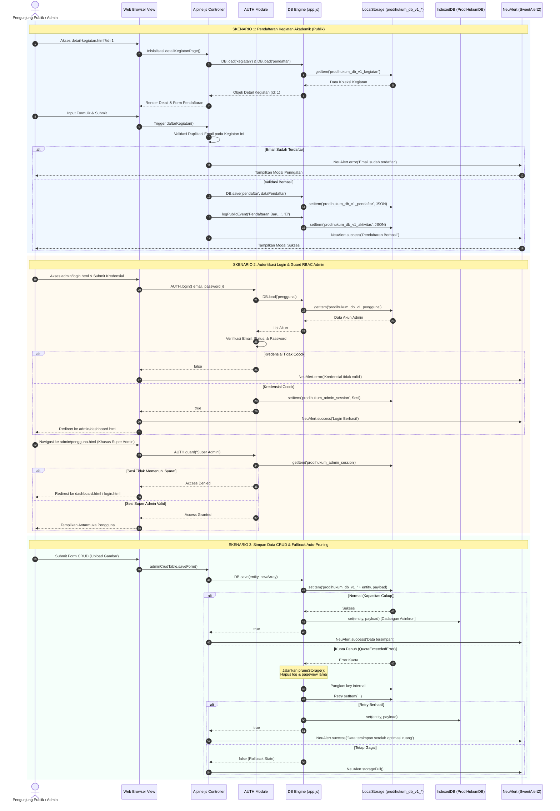
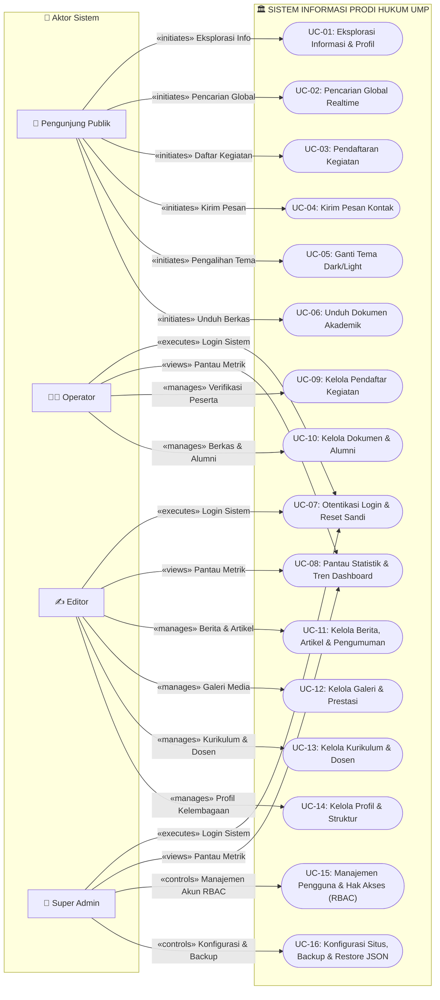
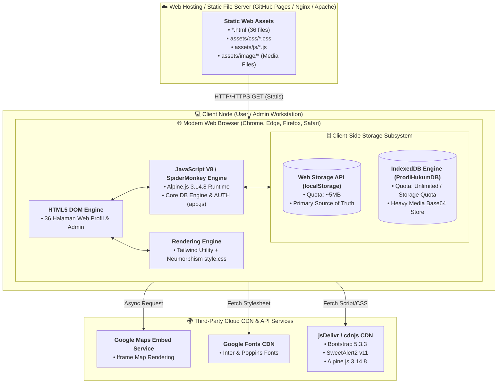

# 🏛️ DOKUMEN ANALISA & PERANCANGAN SISTEM (FINAL)

## Website Profil & Panel Admin Program Studi Hukum — Universitas Muhammadiyah Papua (UMP)

> Dokumen ini adalah laporan rekayasa perangkat lunak final yang memuat **Analisa Sistem, Spesifikasi Kebutuhan, dan 8 Diagram Perancangan Berbasis Mermaid Code** yang diverifikasi akurat dan konsisten dengan basis kode yang berjalan.

---

## 📑 DAFTAR ISI

1. [Spesifikasi & Batasan Sistem](#1-spesifikasi-batasan-sistem)
2. [DFD Level 0 (Diagram Konteks)](#2-dfd-level-0-diagram-konteks)
3. [DFD Level 1 (Dekomposisi Proses Utama)](#3-dfd-level-1-dekomposisi-proses-utama)
4. [Entity Relationship Diagram (ERD)](#4-entity-relationship-diagram-erd)
5. [Sequence Diagram](#5-sequence-diagram)
6. [Flowchart Sistem](#6-flowchart-sistem)
7. [Component Diagram (Diagram Komponen)](#7-component-diagram-diagram-komponen)
8. [Use Case Diagram](#8-use-case-diagram)
9. [Deployment Diagram](#9-deployment-diagram)
10. [Daftar Berkas Diagram Terpisah (.mmd)](#10-daftar-berkas-diagram-terpisah-mmd)
11. [Daftar Berkas Draw.io XML & Panduan Import](#11-daftar-berkas-drawio-xml--panduan-import)

---

## 1. 📋 Spesifikasi & Batasan Sistem

### 1.1 Arsitektur Data Klien (Client-Side Storage Architecture)

- **Single Source of Truth**: Data dikelola pada sisi browser memanfaatkan **Web Storage API (`localStorage`)** dengan isolasi _namespace_ `prodihukum_db_v1_<entity>`.
- **Media Backing Store**: Didukung oleh **IndexedDB** (`ProdiHukumDB`) untuk file biner/base64 kapasitas besar tanpa batasan kuota sempit localStorage (±5 MB).

### 1.2 Matriks Hak Akses (Role-Based Access Control)

- **Pengunjung Publik**: Akses penuh ke 18 halaman publik, pencarian instan 9 entitas, pengiriman form kontak & pendaftaran kegiatan.
- **Operator**: Mengelola pendaftar kegiatan, input data operasional, dan melihat dashboard statistik.
- **Editor**: Mengelola konten berita, artikel, kegiatan, pengumuman, galeri, dan prestasi.
- **Super Admin**: Hak akses penuh seluruh modul CRUD, manajemen pengguna & peran (`admin/pengguna.html`), dan konfigurasi identitas/backup JSON (`admin/pengaturan.html`).

### 1.3 Struktur Berkas Proyek (36 Halaman HTML)

```
Perancangan-Dan-Pengembangan-website-profil-UMP/
├── index.html                   # Beranda Utama Website
├── profil.html                  # Profil, Visi-Misi, Sejarah, & Struktur
├── dosen.html                   # Direktori Dosen & Modal Profil
├── kurikulum.html               # Struktur Kurikulum & Sebaran SKS
├── berita.html                  # Indeks Berita Kampus
├── pengumuman.html              # Pengumuman & Edaran Akademik
├── kegiatan.html                # Agenda & Kalender Kegiatan
├── artikel.html                 # Artikel & Opini Hukum
├── prestasi.html                # Galeri Prestasi Civitas Akademika
├── alumni.html                  # Database Alumni & Tracer Study
├── galeri.html                  # Album Dokumentasi Foto
├── dokumen.html                 # Download Dokumen & Panduan
├── kontak.html                  # Informasi Kontak & Form Pesan
├── detail-berita.html           # Halaman Detail Berita
├── detail-pengumuman.html       # Halaman Detail Pengumuman
├── detail-kegiatan.html         # Halaman Detail & Form Daftar Kegiatan
├── detail-artikel.html          # Halaman Detail Artikel Hukum
├── detail-galeri.html           # Slideshow & Detail Album Galeri
│
├── admin/                       # PANEL ADMINISTRASI (RBAC GUARD)
│   ├── login.html               # Portal Otentikasi Admin
│   ├── lupa-sandi.html          # Alur Reset Kata Sandi Admin
│   ├── dashboard.html           # Ringkasan Statistik & Tren Konten
│   ├── profil-prodi.html        # Kelola Profil & Struktur Prodi
│   ├── dosen.html               # CRUD Data Dosen
│   ├── kurikulum.html           # CRUD Mata Kuliah
│   ├── berita.html              # CRUD Berita
│   ├── pengumuman.html          # CRUD Pengumuman
│   ├── kegiatan.html            # CRUD Kegiatan & Kelola Pendaftar
│   ├── prestasi.html            # CRUD Prestasi
│   ├── artikel.html             # CRUD Artikel Hukum
│   ├── galeri.html              # CRUD Galeri Foto
│   ├── dokumen.html             # CRUD Dokumen Akademik
│   ├── alumni.html              # CRUD Alumni
│   ├── pengguna.html            # CRUD Akun (Khusus Super Admin)
│   ├── aktivitas.html           # Log Audit Trail Sistem
│   ├── activity-log.html        # Redirect resmi ke aktivitas.html
│   └── pengaturan.html          # Konfigurasi & Backup (Khusus Super Admin)
│
├── assets/
│   ├── css/
│   │   ├── style.css            # Neumorphism Tokens & Dark Mode (785 baris)
│   │   └── tailwind.min.css     # Build Utilitas Tailwind CSS
│   ├── js/
│   │   └── app.js               # Core DB Engine, AUTH, & Alpine Controllers (2.027 baris)
│   └── image/                   # Repositori Aset Gambar Resmi
│
└── docs/                        # DOKUMENTASI & DIAGRAM SISTEM
    ├── spesifikasi-sistem.md
    ├── analisa-perancangan-sistem.md
    └── diagrams/
        ├── preview-diagrams.html # Viewer interaktif + Zoom Engine
        ├── dfd-level-0.mmd
        ├── dfd-level-1.mmd
        ├── er-diagram.mmd
        ├── sequence-diagram.mmd
        ├── flowchart-sistem.mmd
        ├── component-diagram.mmd
        ├── usecase-diagram.mmd
        └── deployment-diagram.mmd
```

---

## 2. 🌐 DFD Level 0 (Diagram Konteks)

_Berkas sumber:_ `docs/diagrams/dfd-level-0.mmd`

```mermaid
flowchart TB
    %% ==========================================
    %% 1. PRESENTATION & UI LAYER
    %% ==========================================
    subgraph PRESENTATION["🌐 1. Presentation & Styling Layer (Client Browser)"]
        subgraph PUB_VIEWS["📄 Public View Components (18 Halaman HTML)"]
            PUB_PAGES["<b>Public Pages</b><br/>• index.html, profil.html, dosen.html<br/>• kurikulum.html, berita.html, pengumuman.html<br/>• kegiatan.html, artikel.html, prestasi.html<br/>• alumni.html, galeri.html, dokumen.html, kontak.html"]
            PUB_DETAIL["<b>Detail Views</b><br/>• detail-berita.html, detail-artikel.html<br/>• detail-pengumuman.html, detail-kegiatan.html<br/>• detail-galeri.html"]
        end

        subgraph ADM_VIEWS["🔐 Admin View Components (18 Halaman HTML)"]
            ADM_AUTH["<b>Auth Views</b><br/>• login.html, lupa-sandi.html"]
            ADM_DASH["<b>Dashboard & Config</b><br/>• dashboard.html, pengaturan.html<br/>• profil-prodi.html, aktivitas.html"]
            ADM_CRUD["<b>CRUD Management Views</b><br/>• berita.html, pengumuman.html, kegiatan.html<br/>• artikel.html, prestasi.html, dosen.html<br/>• kurikulum.html, alumni.html, galeri.html<br/>• dokumen.html, pengguna.html"]
        end

        subgraph DESIGN_SYSTEM["🎨 Neumorphism Design System"]
            CSS_TOKENS["<b>style.css</b><br/>• Neumorphic Tokens (--neu-light, --neu-dark)<br/>• Theme Tokens (Light & Dark Mode)<br/>• Component Classes (.neu-raised, .neu-pressed, .neu-btn)"]
            TW_ENGINE["<b>Tailwind CSS 3.4 & Bootstrap 5.3</b><br/>• tailwind.min.css (Utility Classes)<br/>• Responsive Grid Subsystem"]
        end
    end

    %% ==========================================
    %% 2. CONTROLLER & REACTIVE LOGIC LAYER
    %% ==========================================
    subgraph CONTROLLER["⚡ 2. Reactive Controller Layer (Alpine.js Components)"]
        HEADER_CTRL["<b>siteHeader & themeStore</b><br/>• Dark/Light Mode Switcher<br/>• Mobile Drawer Navigation<br/>• syncThemeColorMeta()"]
        SEARCH_CTRL["<b>globalSearch Controller</b><br/>• Realtime Query Filter<br/>• getSearchIndex() Connector"]
        DETAIL_CTRL["<b>Public Detail Controllers</b><br/>• detailBeritaPage(), detailKegiatanPage()<br/>• daftarKegiatan() & Form Pendaftaran<br/>• contactForm() & detailContentPage()"]
        
        ADM_SHELL_CTRL["<b>adminShell Controller</b><br/>• Sesi State & Logout Trigger<br/>• Sidebar Responsive Toggle<br/>• Notifikasi Polling & Badge Counter"]
        ADM_CRUD_CTRL["<b>adminCrudTable & Data Controllers</b><br/>• Generic CRUD Manager (rows, filter, paginate)<br/>• Image Compression Trigger<br/>• adminPenggunaTable() & adminDokumenTable()"]
        ALERT_WRAPPER["<b>NeuAlert (SweetAlert2 Wrapper)</b><br/>• Modal Konfirmasi Hapus & Dialog Sukses<br/>• Alert Quota Storage Penuh (storageFull)"]
    end

    %% ==========================================
    %% 3. BUSINESS LOGIC & PERSISTENCE ENGINE
    %% ==========================================
    subgraph CORE_ENGINE["⚙️ 3. Core Logic & Persistence Engine (assets/js/app.js)"]
        subgraph AUTH_MODULE["🔑 Authentication & Access Control Subsystem"]
            AUTH_CORE["<b>AUTH Engine</b><br/>• AUTH.login(matchedUser)<br/>• AUTH.logout()<br/>• AUTH.current() & AUTH.isLoggedIn()<br/>• AUTH.guard(requiredRole)"]
            RBAC_RULES["<b>Role-Based Access Control (RBAC)</b><br/>• Super Admin: Akses Penuh<br/>• Editor: Kelola Konten & Publikasi<br/>• Operator: Entri Data Terbatas"]
        end

        subgraph DB_ENGINE["🗄️ Database Management Subsystem (DB Engine)"]
            DB_CORE["<b>DB Interface</b><br/>• DB.load(entityKey, seedFallback)<br/>• DB.save(entityKey, payload)<br/>• DB.reset(entityKey) & DB.resetAll()<br/>• DB.optimizeStorage()"]
            PRUNE_SYS["<b>Storage Optimization & Pruning</b><br/>• QuotaExceededError Handler<br/>• pruneStorage() (Pangkas Pageview & Log Lama)<br/>• compressImageFile() (Otomatis Kompres Gambar)"]
            AUDIT_SYS["<b>Audit Trail & Activity Logger</b><br/>• logActivity(aksi, icon)<br/>• logPublicEvent(aksi, icon)"]
        end

        subgraph IDB_MODULE["📦 Unlimited Media Backing Store (IDB Engine)"]
            IDB_CORE["<b>IndexedDB Connector (ProdiHukumDB)</b><br/>• IDB.get(key)<br/>• IDB.set(key, val)<br/>• IDB.clear()"]
        end

        subgraph SEED_REPO["🌱 Seed Fixtures Repository"]
            SEED_DATA["<b>Default Fixtures (16 Entitas)</b><br/>• SEED_BERITA, SEED_DOSEN, SEED_PENGUMUMAN<br/>• SEED_KEGIATAN, SEED_KURIKULUM, SEED_ALUMNI<br/>• SEED_PENGGUNA, SEED_PROFIL, SEED_PENGATURAN, dll."]
        end
    end

    %% ==========================================
    %% 4. STORAGE & EXTERNAL SERVICES LAYER
    %% ==========================================
    subgraph STORAGE_EXT["💾 4. Client Storage & External Integrations"]
        subgraph BROWSER_STORAGE["💽 Local Client Storage Subsystem"]
            LOCAL_STORAGE[("<b>Web Storage API (localStorage)</b><br/>• prodihukum_db_v1_&lt;entity&gt;<br/>• prodihukum_admin_session<br/>• prodihukum_pageviews_v1<br/>• theme (light/dark)")]
            INDEXED_DB[("<b>IndexedDB Storage</b><br/>• DB Name: ProdiHukumDB<br/>• ObjectStore: entities<br/>• Unlimited Media & Blob Storage")]
        end

        subgraph EXT_SERVICES["☁️ External CDN & Web Services"]
            MAPS_API["<b>Google Maps Embed Service</b><br/>• Iframe Peta Lokasi Kampus / Kegiatan"]
            CDN_FONTS["<b>Google Fonts API</b><br/>• Inter (Sans-serif) & Poppins (Display)"]
            CDN_LIBS["<b>JavaScript CDN Providers</b><br/>• Alpine.js 3.14.8, SweetAlert2 v11, Bootstrap 5.3.3"]
        end
    end

    %% ==========================================
    %% INTER-COMPONENT RELATIONSHIPS & DEPENDENCIES
    %% ==========================================
    
    %% Styling Dependencies
    PUB_VIEWS -.-> DESIGN_SYSTEM
    ADM_VIEWS -.-> DESIGN_SYSTEM
    DESIGN_SYSTEM -.-> CDN_FONTS
    DESIGN_SYSTEM -.-> CDN_LIBS

    %% View -> Controller Bindings
    PUB_PAGES --> HEADER_CTRL
    PUB_PAGES --> SEARCH_CTRL
    PUB_DETAIL --> DETAIL_CTRL
    PUB_PAGES -. "Embeds iframe" .-> MAPS_API
    
    ADM_AUTH --> AUTH_CORE
    ADM_DASH --> ADM_SHELL_CTRL
    ADM_CRUD --> ADM_CRUD_CTRL
    ADM_CRUD_CTRL --> ALERT_WRAPPER
    ADM_SHELL_CTRL --> ALERT_WRAPPER

    %% Controller -> Core Logic Dependencies
    HEADER_CTRL -- "Write theme preference" --> LOCAL_STORAGE
    SEARCH_CTRL -- "Request aggregate index" --> DB_CORE
    DETAIL_CTRL -- "Load/Save Data (Pendaftar, dll.)" --> DB_CORE
    DETAIL_CTRL -- "Trigger logPublicEvent()" --> AUDIT_SYS

    ADM_SHELL_CTRL -- "Check session status" --> AUTH_CORE
    ADM_CRUD_CTRL -- "Read / Write Data" --> DB_CORE
    ADM_CRUD_CTRL -- "Trigger logActivity()" --> AUDIT_SYS
    ADM_CRUD_CTRL -- "Request image compression" --> PRUNE_SYS
    ADM_AUTH -- "Submit credentials" --> AUTH_CORE

    %% Core Logic Internal Interactions
    AUTH_CORE -- "Verify role permissions" --> RBAC_RULES
    AUTH_CORE -- "Read user list ('pengguna')" --> DB_CORE
    AUTH_CORE -- "Write/Delete prodihukum_admin_session" --> LOCAL_STORAGE
    
    DB_CORE -- "Initial load if store empty" --> SEED_DATA
    DB_CORE -- "Auto-invoke on QuotaExceeded" --> PRUNE_SYS
    DB_CORE -- "Primary synchronous I/O (prodihukum_db_v1_*)" --> LOCAL_STORAGE
    DB_CORE -- "Async backup storage" --> IDB_CORE
    IDB_CORE -- "Store heavy media / base64" --> INDEXED_DB

    AUDIT_SYS -- "Persist audit trail ('aktivitas' & 'notifikasi')" --> DB_CORE
    PRUNE_SYS -- "Prune old logs & pageviews" --> LOCAL_STORAGE
```



---

## 3. 🔄 DFD Level 1 (Dekomposisi Proses Utama)

_Berkas sumber:_ `docs/diagrams/dfd-level-1.mmd`

```mermaid
flowchart TB
    subgraph ENTITAS["👥 Entitas Eksternal"]
        P["👤 Pengunjung Publik"]
        A["🔐 Admin (Super Admin / Editor / Operator)"]
    end

    subgraph PROSES["⚙️ Proses Sistem (Level 1)"]
        P1["1.0<br/>Manajemen Tampilan Konten Publik"]
        P2["2.0<br/>Pencarian Global Realtime"]
        P3["3.0<br/>Pendaftaran Kegiatan Akademik"]
        P4["4.0<br/>Pengiriman Formulir Kontak"]
        P5["5.0<br/>Autentikasi & Guard RBAC"]
        P6["6.0<br/>Manajemen Konten CRUD (11 Modul)"]
        P7["7.0<br/>Manajemen Akun Pengguna & Peran"]
        P8["8.0<br/>Pencatatan Audit Trail & Notifikasi"]
        P9["9.0<br/>Pengaturan Situs & Backup / Restore"]
        P10["10.0<br/>Agregasi Statistik & Tren Dashboard"]
    end

    subgraph DATASTORES["🗄️ Data Store (localStorage & IndexedDB)"]
        DS1[("D1 · berita")]
        DS2[("D2 · dosen")]
        DS3[("D3 · dokumen")]
        DS4[("D4 · galeri")]
        DS5[("D5 · pengumuman")]
        DS6[("D6 · kegiatan")]
        DS7[("D7 · pendaftar")]
        DS8[("D8 · artikel")]
        DS9[("D9 · prestasi")]
        DS10[("D10 · kurikulum")]
        DS11[("D11 · alumni")]
        DS12[("D12 · pengguna")]
        DS13[("D13 · aktivitas")]
        DS14[("D14 · notifikasi")]
        DS15[("D15 · profil & struktur")]
        DS16[("D16 · pengaturan")]
        DSPV[("PV · prodihukum_pageviews_v1")]
    end

    %% Aliran Pengunjung
    P -- "Akses Halaman & Filter Kategori" --> P1
    P1 -- "Read Data" --> DS1 & DS2 & DS3 & DS4 & DS5 & DS6 & DS8 & DS9 & DS10 & DS11 & DS15 & DS16
    P1 -- "Write Hit (trackPageView)" --> DSPV
    P1 -- "Render Halaman / Detail" --> P

    P -- "Input Kueri Pencarian" --> P2
    P2 -- "Read Index Gabungan" --> DS1 & DS2 & DS3 & DS5 & DS6 & DS8 & DS9 & DS10 & DS11
    P2 -- "Daftar Hasil Pencarian" --> P

    P -- "Submit Data Pendaftar" --> P3
    P3 -- "Write Data Peserta" --> DS7
    P3 -- "Trigger Log Publik" --> P8
    P3 -- "Konfirmasi Sukses" --> P

    P -- "Submit Pesan" --> P4
    P4 -- "Validasi & Feedback" --> P

    %% Aliran Admin
    A -- "Input Email & Password" --> P5
    P5 -- "Read Kredensial" --> DS12
    P5 -- "Set Sesi Admin & Guard" --> A

    A -- "Create / Update / Delete" --> P6
    P6 -- "Write Data Koleksi" --> DS1 & DS2 & DS3 & DS4 & DS5 & DS6 & DS8 & DS9 & DS10 & DS11 & DS15
    P6 -- "Catat Aksi Admin" --> P8

    A -- "Kelola Akun (Super Admin)" --> P7
    P7 -- "Write Akun Admin" --> DS12
    P7 -- "Catat Aksi Admin" --> P8

    P8 -- "Write Log" --> DS13
    P8 -- "Write Notif" --> DS14

    A -- "Ubah Identitas / Backup / Reset" --> P9
    P9 -- "Write Pengaturan" --> DS15 & DS16
    P9 -- "Catat Aksi Admin" --> P8

    A -- "Akses Dashboard" --> P10
    P10 -- "Hitung Metrik & Tren" --> DS1 & DS2 & DS11 & DS12 & DSPV & DS13
    P10 -- "Render Widget Statistik" --> A
```



---

## 4. 🗄️ Entity Relationship Diagram (ERD)

_Berkas sumber:_ `docs/diagrams/er-diagram.mmd`

```mermaid
erDiagram
    KEGIATAN ||--o{ PENDAFTAR : "memiliki pendaftar (kegiatanId)"
    KEGIATAN ||--o{ GALERI : "dokumentasi kegiatan"
    PENGGUNA ||--o{ AKTIVITAS : "mencatat log aktivitas (user)"
    PENGGUNA ||--o{ NOTIFIKASI : "menerima notifikasi"
    PENGGUNA ||--o{ BERITA : "menerbitkan warta (penulis)"
    PENGGUNA ||--o{ ARTIKEL : "membuat publikasi (penulis)"
    PENGGUNA ||--o{ PENGUMUMAN : "merilis pengumuman"
    PENGGUNA ||--o{ DOKUMEN : "mengunggah dokumen"
    PROFIL ||--|{ STRUKTUR : "memiliki struktur organisasi"
    DOSEN ||--o| STRUKTUR : "penugasan jabatan struktural"
    DOSEN ||--o{ KURIKULUM : "dosen pengampu matakuliah"
    DOSEN ||--o{ PRESTASI : "penghargaan dosen"
    ALUMNI ||--o{ PRESTASI : "rekam jejak prestasi"
    PROFIL ||--|| PENGATURAN : "konfigurasi situs & prodi"
    PROFIL ||--|{ DOKUMEN : "dokumen SK & akreditasi"
    PROFIL ||--|{ KURIKULUM : "struktur kurikulum prodi"

    BERITA {
        int id PK
        string slug
        string judul
        string kategori
        string tanggal
        string penulis FK "Mereferensi PENGGUNA.nama"
        string excerpt
        string konten
        string status "Draft | Review | Published"
        bool featured
        string gambar "Path / Base64"
    }

    DOSEN {
        int id PK
        string nama
        string jabatan
        string keahlian
        string pendidikan
        string email
        string nidn
        string profil
        string status "Aktif | Cuti | Tugas Belajar"
        string foto "Path / Base64"
    }

    DOKUMEN {
        int id PK
        string nama
        string kategori "Kurikulum | Panduan | SK | Formulir"
        string format "PDF | DOCX | XLS"
        string ukuran
        int tahun
        string fileUrl
        int downloads
    }

    GALERI {
        int id PK
        string judul
        string album "Seminar | Kuliah Umum | Praktikum | Wisuda | dll"
        string src "Path / Base64"
        string tanggal
    }

    PENGUMUMAN {
        int id PK
        string judul
        string status "Penting | Baru | Aktif | Berakhir"
        string badge "badge-important | badge-new | badge-active"
        string tanggal
        string isi
        string lampiran
    }

    KEGIATAN {
        int id PK
        string nama
        string tanggal
        string hari
        string bulan
        string waktu
        string lokasi
        string penyelenggara
        string deskripsi
        string gambar "Path / Base64"
    }

    PENDAFTAR {
        int id PK
        int kegiatanId FK "Mereferensi KEGIATAN.id"
        string kegiatanNama
        string nama
        string email
        string whatsapp
        string instansi
        string waktuDaftar
    }

    ARTIKEL {
        int id PK
        string judul
        string penulis FK "Mereferensi PENGGUNA / DOSEN"
        string kategori "Hukum Pidana | Tata Negara | Adat | Bisnis"
        string tanggal
        string isi
        string referensi
        string tags
        string status "Draft | Review | Published"
        string thumbnail "Path / Base64"
    }

    PRESTASI {
        int id PK
        string nama
        string kategori "Mahasiswa | Dosen | Alumni | Program Studi"
        string tingkat "Provinsi | Regional | Nasional | Internasional"
        string tahun
        string foto "Path / Base64"
    }

    KURIKULUM {
        int id PK
        string kode
        string nama
        int sks
        string jenis "Wajib | Pilihan"
        int semester
        string silabusUrl
        string deskripsi
    }

    ALUMNI {
        int id PK
        string nama
        string angkatan
        string pekerjaan
        string instansi
        string kategori "Bekerja | Studi Lanjut | Wirausaha"
        string email
        string linkedin
        string status "Terverifikasi | Menunggu"
        string foto "Path / Base64"
    }

    PENGGUNA {
        int id PK
        string nama
        string email
        string password
        string role "Super Admin | Editor | Operator"
        string status "Aktif | Nonaktif"
    }

    AKTIVITAS {
        int id PK
        string user FK "Mereferensi PENGGUNA.nama"
        string aksi
        string waktu
        string tanggalIso
        string icon
    }

    NOTIFIKASI {
        int id PK
        string judul
        string pesan
        string waktu
        bool read
        string icon
    }

    PROFIL {
        string nama
        string kode
        string fakultas
        string universitas
        string akreditasi
        string deskripsi
        string sejarah
        string visi
        string misi
        string tujuan
        string lulusan
    }

    STRUKTUR {
        int id PK
        string nama
        string jabatan
        string foto
    }

    PENGATURAN {
        string namaWebsite
        string deskripsi
        string logo
        string favicon
        string theme
        string primaryColor
        bool darkMode
        string metaTitle
        string metaDesc
        string keywords
        string email
        string telepon
        string alamat
        string mapEmbed
        string mapLink
        string koordinat
        int mahasiswaAktif
    }
```



---

## 5. ⏱️ Sequence Diagram

_Berkas sumber:_ `docs/diagrams/sequence-diagram.mmd`



---

## 6. 🔀 Flowchart Sistem

_Berkas sumber:_ `docs/diagrams/flowchart-sistem.mmd`

```mermaid
flowchart TD
    %% SUB-FLOW 1: PENGUNJUNG PUBLIK
    subgraph PUBLIC_FLOW["🌐 ALUR INTERAKSI PENGUNJUNG PUBLIK"]
        P_Start([Mulai: Pengunjung Buka Website]) -->|Inisialisasi Aplikasi| P_Choice{Pilih Menu / Fitur}

        P_Choice -->|1. Akses Informasi| P_Load[Muat Data dari LocalStorage & IndexedDB]
        P_Load -->|Koleksi Dimuat| P_PV[Catat Pageview Harian otomatis]
        P_PV -->|Hit Tercatat| P_Render[Render Tampilan Responsif & Interaktif]

        P_Choice -->|2. Pencarian Global| P_Search[/Input Kata Kunci/]
        P_Search -->|Kueri Dikirim| P_ExecSearch[Cari pada Indeks 9 Entitas Data]
        P_ExecSearch -->|Hasil Ditemukan| P_RenderSearch[Tampilkan Hasil & Tautan Langsung]

        P_Choice -->|3. Pendaftaran Kegiatan| P_OpenKeg[Buka detail-kegiatan.html?id=...]
        P_OpenKeg -->|Submit Form Event| P_FillKeg[/Isi Formulir Pendaftaran/]
        P_FillKeg -->|Cek Duplikasi| P_ValEmail{Email Sudah Terdaftar?}
        P_ValEmail -- Ya (Duplikat) --> P_ErrEmail[Tampilkan SweetAlert Error]
        P_ValEmail -- Tidak (Valid) --> P_SaveKeg[Simpan ke 'pendaftar' & Catat Log]
        P_SaveKeg -->|Commit Berhasil| P_OkKeg[Tampilkan SweetAlert Sukses]

        P_Choice -->|4. Ganti Tema| P_ToggleDark[Klik Tombol Mode Gelap/Terang]
        P_ToggleDark -->|Simpan Preferensi| P_ApplyTheme[Toggle Class .dark & Simpan ke localStorage]

        P_Render -->|Navigasi Selesai| P_End([Selesai])
        P_RenderSearch -->|Buka Detail Konten| P_End
        P_ErrEmail -->|Tutup Alert Error| P_End
        P_OkKeg -->|Unduh Tiket PDF| P_End
        P_ApplyTheme -->|Terapkan Tema Baru| P_End
    end

    %% SUB-FLOW 2: PANEL ADMINISTRASI
    subgraph ADMIN_FLOW["🔐 ALUR AUTENTIKASI & KONTROL AKSES (RBAC) ADMIN"]
        A_Start([Mulai: Buka Panel Admin]) -->|Akses URL /admin/*| A_CheckLogin{Halaman Login?}

        A_CheckLogin -- Ya (Halaman Login) --> A_HasSession{Ada Sesi Aktif?}
        A_HasSession -- Ya (Sesi Valid) --> A_DirectDash[Redirect ke dashboard.html]
        A_HasSession -- Tidak (Belum Login) --> A_ShowForm[Tampilkan Form Login]
        A_ShowForm -->|Kirim Kredensial| A_SubmitCreds[/Input Email & Password/]
        A_SubmitCreds -->|Validasi Hash SHA-256| A_VerifyAcc{Verifikasi Kredensial & Status}
        A_VerifyAcc -- Gagal / Nonaktif --> A_AlertFail[SweetAlert: Kredensial Tidak Valid]
        A_AlertFail -->|Ulangi Login| A_ShowForm
        A_VerifyAcc -- Sukses --> A_CreateSession[Simpan Sesi ke prodihukum_admin_session]
        A_CreateSession -->|Masuk Dashboard| A_DirectDash

        A_CheckLogin -- Tidak (Halaman CRUD/Modul) --> A_RunGuard["Eksekusi AUTH.guard()"]
        A_RunGuard -->|Periksa sessionStorage| A_CheckAuth{Sesi Valid?}
        A_CheckAuth -- Tidak (Tidak Ada Sesi) --> A_RedirectLogin[Redirect ke login.html]
        A_CheckAuth -- Ya (Terotentikasi) --> A_CheckRole{Halaman Khusus Super Admin?}

        A_CheckRole -- Ya (pengguna/pengaturan) --> A_IsSuper{Role === 'Super Admin'?}
        A_IsSuper -- Tidak (Hak Ditolak) --> A_DenyAlert[SweetAlert: Hak Akses Ditolak]
        A_DenyAlert -->|Kembali ke Dashboard| A_DirectDash
        A_IsSuper -- Ya (Otorisasi Penuh) --> A_AllowSuper[Buka Manajemen Pengguna/Pengaturan]

        A_CheckRole -- Tidak (Modul CRUD Umum) --> A_AllowGeneral[Buka Modul CRUD Sesuai Role]

        A_AllowSuper -->|Akses Penuh Super Admin| A_ExecCRUD[Operasi: Tambah / Edit / Hapus / Backup]
        A_AllowGeneral -->|Akses Terbatas Editor/Operator| A_ExecCRUD
        A_ExecCRUD -->|Commit Transaksi| A_SaveData[Simpan ke LocalStorage & Cadangkan ke IDB]
        A_SaveData -->|Trigger Audit Trail| A_WriteLog[Pencatatan Otomatis Log Audit]
        A_WriteLog -->|Perbarui Tampilan| A_RefreshTable[Pembaruan Tabel Reaktif]

        A_DirectDash -->|Sesi Berjalan| A_End([Selesai])
        A_RedirectLogin -->|Kembali ke Login| A_End
        A_RefreshTable -->|Operasi Selesai| A_End
    end
```



---

## 7. 🧩 Component Diagram (Diagram Komponen)

_Berkas sumber:_ `docs/diagrams/component-diagram.mmd`

```mermaid
flowchart TB
    %% ==========================================
    %% 1. PRESENTATION & UI LAYER
    %% ==========================================
    subgraph PRESENTATION["🌐 1. Presentation & Styling Layer (Client Browser)"]
        subgraph PUB_VIEWS["📄 Public View Components (18 Halaman HTML)"]
            PUB_PAGES["<b>Public Pages</b><br/>• index.html, profil.html, dosen.html<br/>• kurikulum.html, berita.html, pengumuman.html<br/>• kegiatan.html, artikel.html, prestasi.html<br/>• alumni.html, galeri.html, dokumen.html, kontak.html"]
            PUB_DETAIL["<b>Detail Views</b><br/>• detail-berita.html, detail-artikel.html<br/>• detail-pengumuman.html, detail-kegiatan.html<br/>• detail-galeri.html"]
        end

        subgraph ADM_VIEWS["🔐 Admin View Components (18 Halaman HTML)"]
            ADM_AUTH["<b>Auth Views</b><br/>• login.html, lupa-sandi.html"]
            ADM_DASH["<b>Dashboard & Config</b><br/>• dashboard.html, pengaturan.html<br/>• profil-prodi.html, aktivitas.html"]
            ADM_CRUD["<b>CRUD Management Views</b><br/>• berita.html, pengumuman.html, kegiatan.html<br/>• artikel.html, prestasi.html, dosen.html<br/>• kurikulum.html, alumni.html, galeri.html<br/>• dokumen.html, pengguna.html"]
        end

        subgraph DESIGN_SYSTEM["🎨 Neumorphism Design System"]
            CSS_TOKENS["<b>style.css</b><br/>• Neumorphic Tokens (--neu-light, --neu-dark)<br/>• Theme Tokens (Light & Dark Mode)<br/>• Component Classes (.neu-raised, .neu-pressed, .neu-btn)"]
            TW_ENGINE["<b>Tailwind CSS 3.4 & Bootstrap 5.3</b><br/>• tailwind.min.css (Utility Classes)<br/>• Responsive Grid Subsystem"]
        end
    end

    %% ==========================================
    %% 2. CONTROLLER & REACTIVE LOGIC LAYER
    %% ==========================================
    subgraph CONTROLLER["⚡ 2. Reactive Controller Layer (Alpine.js Components)"]
        HEADER_CTRL["<b>siteHeader & themeStore</b><br/>• Dark/Light Mode Switcher<br/>• Mobile Drawer Navigation<br/>• syncThemeColorMeta()"]
        SEARCH_CTRL["<b>globalSearch Controller</b><br/>• Realtime Query Filter<br/>• getSearchIndex() Connector"]
        DETAIL_CTRL["<b>Public Detail Controllers</b><br/>• detailBeritaPage(), detailKegiatanPage()<br/>• daftarKegiatan() & Form Pendaftaran<br/>• contactForm() & detailContentPage()"]

        ADM_SHELL_CTRL["<b>adminShell Controller</b><br/>• Sesi State & Logout Trigger<br/>• Sidebar Responsive Toggle<br/>• Notifikasi Polling & Badge Counter"]
        ADM_CRUD_CTRL["<b>adminCrudTable & Data Controllers</b><br/>• Generic CRUD Manager (rows, filter, paginate)<br/>• Image Compression Trigger<br/>• adminPenggunaTable() & adminDokumenTable()"]
        ALERT_WRAPPER["<b>NeuAlert (SweetAlert2 Wrapper)</b><br/>• Modal Konfirmasi Hapus & Dialog Sukses<br/>• Alert Quota Storage Penuh (storageFull)"]
    end

    %% ==========================================
    %% 3. BUSINESS LOGIC & PERSISTENCE ENGINE
    %% ==========================================
    subgraph CORE_ENGINE["⚙️ 3. Core Logic & Persistence Engine (assets/js/app.js)"]
        subgraph AUTH_MODULE["🔑 Authentication & Access Control Subsystem"]
            AUTH_CORE["<b>AUTH Engine</b><br/>• AUTH.login(matchedUser)<br/>• AUTH.logout()<br/>• AUTH.current() & AUTH.isLoggedIn()<br/>• AUTH.guard(requiredRole)"]
            RBAC_RULES["<b>Role-Based Access Control (RBAC)</b><br/>• Super Admin: Akses Penuh<br/>• Editor: Kelola Konten & Publikasi<br/>• Operator: Entri Data Terbatas"]
        end

        subgraph DB_ENGINE["🗄️ Database Management Subsystem (DB Engine)"]
            DB_CORE["<b>DB Interface</b><br/>• DB.load(entityKey, seedFallback)<br/>• DB.save(entityKey, payload)<br/>• DB.reset(entityKey) & DB.resetAll()<br/>• DB.optimizeStorage()"]
            PRUNE_SYS["<b>Storage Optimization & Pruning</b><br/>• QuotaExceededError Handler<br/>• pruneStorage() (Pangkas Pageview & Log Lama)<br/>• compressImageFile() (Otomatis Kompres Gambar)"]
            AUDIT_SYS["<b>Audit Trail & Activity Logger</b><br/>• logActivity(aksi, icon)<br/>• logPublicEvent(aksi, icon)"]
        end

        subgraph IDB_MODULE["📦 Unlimited Media Backing Store (IDB Engine)"]
            IDB_CORE["<b>IndexedDB Connector (ProdiHukumDB)</b><br/>• IDB.get(key)<br/>• IDB.set(key, val)<br/>• IDB.clear()"]
        end

        subgraph SEED_REPO["🌱 Seed Fixtures Repository"]
            SEED_DATA["<b>Default Fixtures (16 Entitas)</b><br/>• SEED_BERITA, SEED_DOSEN, SEED_PENGUMUMAN<br/>• SEED_KEGIATAN, SEED_KURIKULUM, SEED_ALUMNI<br/>• SEED_PENGGUNA, SEED_PROFIL, SEED_PENGATURAN, dll."]
        end
    end

    %% ==========================================
    %% 4. STORAGE & EXTERNAL SERVICES LAYER
    %% ==========================================
    subgraph STORAGE_EXT["💾 4. Client Storage & External Integrations"]
        subgraph BROWSER_STORAGE["💽 Local Client Storage Subsystem"]
            LOCAL_STORAGE[("<b>Web Storage API (localStorage)</b><br/>• prodihukum_db_v1_&lt;entity&gt;<br/>• prodihukum_admin_session<br/>• prodihukum_pageviews_v1<br/>• theme (light/dark)")]
            INDEXED_DB[("<b>IndexedDB Storage</b><br/>• DB Name: ProdiHukumDB<br/>• ObjectStore: entities<br/>• Unlimited Media & Blob Storage")]
        end

        subgraph EXT_SERVICES["☁️ External CDN & Web Services"]
            MAPS_API["<b>Google Maps Embed Service</b><br/>• Iframe Peta Lokasi Kampus / Kegiatan"]
            CDN_FONTS["<b>Google Fonts API</b><br/>• Inter (Sans-serif) & Poppins (Display)"]
            CDN_LIBS["<b>JavaScript CDN Providers</b><br/>• Alpine.js 3.14.8, SweetAlert2 v11, Bootstrap 5.3.3"]
        end
    end

    %% ==========================================
    %% INTER-COMPONENT RELATIONSHIPS & DEPENDENCIES
    %% ==========================================

    %% Styling Dependencies
    PUB_VIEWS -.-> DESIGN_SYSTEM
    ADM_VIEWS -.-> DESIGN_SYSTEM
    DESIGN_SYSTEM -.-> CDN_FONTS
    DESIGN_SYSTEM -.-> CDN_LIBS

    %% View -> Controller Bindings
    PUB_PAGES --> HEADER_CTRL
    PUB_PAGES --> SEARCH_CTRL
    PUB_DETAIL --> DETAIL_CTRL
    PUB_PAGES -. "Embeds iframe" .-> MAPS_API

    ADM_AUTH --> AUTH_CORE
    ADM_DASH --> ADM_SHELL_CTRL
    ADM_CRUD --> ADM_CRUD_CTRL
    ADM_CRUD_CTRL --> ALERT_WRAPPER
    ADM_SHELL_CTRL --> ALERT_WRAPPER

    %% Controller -> Core Logic Dependencies
    HEADER_CTRL --> LOCAL_STORAGE : Write theme preference
    SEARCH_CTRL --> DB_CORE : Request aggregate index
    DETAIL_CTRL --> DB_CORE : Load/Save Data (Pendaftar, dll.)
    DETAIL_CTRL --> AUDIT_SYS : Trigger logPublicEvent()

    ADM_SHELL_CTRL --> AUTH_CORE : Check session status
    ADM_CRUD_CTRL --> DB_CORE : Read / Write Data
    ADM_CRUD_CTRL --> AUDIT_SYS : Trigger logActivity()
    ADM_CRUD_CTRL --> PRUNE_SYS : Request image compression
    ADM_AUTH --> AUTH_CORE : Submit credentials

    %% Core Logic Internal Interactions
    AUTH_CORE --> RBAC_RULES : Verify role permissions
    AUTH_CORE --> DB_CORE : Read user list ('pengguna')
    AUTH_CORE --> LOCAL_STORAGE : Write/Delete prodihukum_admin_session

    DB_CORE --> SEED_DATA : Initial load if store empty
    DB_CORE --> PRUNE_SYS : Auto-invoke on QuotaExceeded
    DB_CORE --> LOCAL_STORAGE : Primary synchronous I/O (prodihukum_db_v1_*)
    DB_CORE --> IDB_CORE : Async backup storage
    IDB_CORE --> INDEXED_DB : Store heavy media / base64

    AUDIT_SYS --> DB_CORE : Persist audit trail ('aktivitas' & 'notifikasi')
    PRUNE_SYS --> LOCAL_STORAGE : Prune old logs & pageviews
```

---

## 8. 🎯 Use Case Diagram

_Berkas sumber:_ `docs/diagrams/usecase-diagram.mmd`



---

## 9. 🚀 Deployment Diagram

_Berkas sumber:_ `docs/diagrams/deployment-diagram.mmd`



---

## 10. 📁 Daftar Berkas Diagram Terpisah (.mmd)

Setiap diagram telah disimpan secara individual di dalam direktori `docs/diagrams/` untuk kemudahan ekspor, render CLI, atau integrasi ke tools lain:

1. 📄 [`docs/diagrams/dfd-level-0.mmd`](file:///c:/Users/Asus%20TUF/Documents/Sacode%202025/Latihan/Perancangan-Dan-Pengembangan-website-profil-UMP-/docs/diagrams/dfd-level-0.mmd) — _DFD Level 0 (Context Diagram)_
2. 📄 [`docs/diagrams/dfd-level-1.mmd`](file:///c:/Users/Asus%20TUF/Documents/Sacode%202025/Latihan/Perancangan-Dan-Pengembangan-website-profil-UMP-/docs/diagrams/dfd-level-1.mmd) — _DFD Level 1 (Proses Utama & Datastores)_
3. 📄 [`docs/diagrams/er-diagram.mmd`](file:///c:/Users/Asus%20TUF/Documents/Sacode%202025/Latihan/Perancangan-Dan-Pengembangan-website-profil-UMP-/docs/diagrams/er-diagram.mmd) — _Entity Relationship Diagram (17 Model Data)_
4. 📄 [`docs/diagrams/sequence-diagram.mmd`](file:///c:/Users/Asus%20TUF/Documents/Sacode%202025/Latihan/Perancangan-Dan-Pengembangan-website-profil-UMP-/docs/diagrams/sequence-diagram.mmd) — _Sequence Diagram (Publik, Auth RBAC, Storage Fallback)_
5. 📄 [`docs/diagrams/flowchart-sistem.mmd`](file:///c:/Users/Asus%20TUF/Documents/Sacode%202025/Latihan/Perancangan-Dan-Pengembangan-website-profil-UMP-/docs/diagrams/flowchart-sistem.mmd) — _Flowchart Sistem (Pengunjung & Panel Admin)_
6. 📄 [`docs/diagrams/component-diagram.mmd`](file:///c:/Users/Asus%20TUF/Documents/Sacode%202025/Latihan/Perancangan-Dan-Pengembangan-website-profil-UMP-/docs/diagrams/component-diagram.mmd) — _UML Component Diagram_
7. 📄 [`docs/diagrams/usecase-diagram.mmd`](file:///c:/Users/Asus%20TUF/Documents/Sacode%202025/Latihan/Perancangan-Dan-Pengembangan-website-profil-UMP-/docs/diagrams/usecase-diagram.mmd) — _Use Case Diagram (4 Aktor & 16 Use Cases)_
8. 📄 [`docs/diagrams/deployment-diagram.mmd`](file:///c:/Users/Asus%20TUF/Documents/Sacode%202025/Latihan/Perancangan-Dan-Pengembangan-website-profil-UMP-/docs/diagrams/deployment-diagram.mmd) — _Deployment Architecture Diagram_

---

## 11. 📐 Daftar Berkas Draw.io XML & Panduan Import

Seluruh diagram juga telah dikonversi dan tersedia dalam format **Draw.io XML (`.drawio.xml` / `.xml`)** berstandar mxGraph untuk diedit dan dibuka secara visual di aplikasi [draw.io (diagrams.net)](https://app.diagrams.net):

### 11.1 Berkas Draw.io Individual

1. 📄 [`docs/diagrams/drawio/dfd-level-0.drawio.xml`](file:///c:/Users/Asus%20TUF/Documents/Sacode%202025/Latihan/Perancangan-Dan-Pengembangan-website-profil-UMP-/docs/diagrams/drawio/dfd-level-0.drawio.xml) — _DFD Level 0 (Context Diagram)_
2. 📄 [`docs/diagrams/drawio/dfd-level-1.drawio.xml`](file:///c:/Users/Asus%20TUF/Documents/Sacode%202025/Latihan/Perancangan-Dan-Pengembangan-website-profil-UMP-/docs/diagrams/drawio/dfd-level-1.drawio.xml) — _DFD Level 1 (Dekomposisi Proses)_
3. 📄 [`docs/diagrams/drawio/er-diagram.drawio.xml`](file:///c:/Users/Asus%20TUF/Documents/Sacode%202025/Latihan/Perancangan-Dan-Pengembangan-website-profil-UMP-/docs/diagrams/drawio/er-diagram.drawio.xml) — _ERD (17 Entitas Schema)_
4. 📄 [`docs/diagrams/drawio/sequence-diagram.drawio.xml`](file:///c:/Users/Asus%20TUF/Documents/Sacode%202025/Latihan/Perancangan-Dan-Pengembangan-website-profil-UMP-/docs/diagrams/drawio/sequence-diagram.drawio.xml) — _Sequence Diagram (3 Skenario)_
5. 📄 [`docs/diagrams/drawio/flowchart-sistem.drawio.xml`](file:///c:/Users/Asus%20TUF/Documents/Sacode%202025/Latihan/Perancangan-Dan-Pengembangan-website-profil-UMP-/docs/diagrams/drawio/flowchart-sistem.drawio.xml) — _Flowchart Sistem (Publik & Admin)_
6. 📄 [`docs/diagrams/drawio/component-diagram.drawio.xml`](file:///c:/Users/Asus%20TUF/Documents/Sacode%202025/Latihan/Perancangan-Dan-Pengembangan-website-profil-UMP-/docs/diagrams/drawio/component-diagram.drawio.xml) — _Component Diagram 4-Layer_
7. 📄 [`docs/diagrams/drawio/usecase-diagram.drawio.xml`](file:///c:/Users/Asus%20TUF/Documents/Sacode%202025/Latihan/Perancangan-Dan-Pengembangan-website-profil-UMP-/docs/diagrams/drawio/usecase-diagram.drawio.xml) — _Use Case Diagram_
8. 📄 [`docs/diagrams/drawio/deployment-diagram.drawio.xml`](file:///c:/Users/Asus%20TUF/Documents/Sacode%202025/Latihan/Perancangan-Dan-Pengembangan-website-profil-UMP-/docs/diagrams/drawio/deployment-diagram.drawio.xml) — _Deployment Diagram_

### 11.2 Berkas Master Multi-Page (Semua Diagram Dalam 1 File)

- 📦 [`docs/diagrams/drawio/all-diagrams.drawio.xml`](file:///c:/Users/Asus%20TUF/Documents/Sacode%202025/Latihan/Perancangan-Dan-Pengembangan-website-profil-UMP-/docs/diagrams/drawio/all-diagrams.drawio.xml) — Berisi 8 tab halaman terpisah dalam 1 file master draw.io.

### 11.3 Cara Membuka / Paste ke Draw.io (diagrams.net)

1. **Metode 1 (Buka File Langsung)**: Buka [app.diagrams.net](https://app.diagrams.net) -> Pilih **"Open Existing Diagram"** -> Pilih salah satu berkas `.drawio.xml` di atas.
2. **Metode 2 (Copy-Paste XML)**:
   - Buka berkas XML dan salin (Copy) seluruh isinya (atau gunakan tombol **"Salin Draw.io XML"** pada [`preview.html`](file:///c:/Users/Asus%20TUF/Documents/Sacode%202025/Latihan/Perancangan-Dan-Pengembangan-website-profil-UMP-/preview.html)).
   - Di draw.io, klik menu **Extras** -> **Edit Diagram...**.
   - Hapus teks yang ada, tempelkan (Paste) teks XML tersebut, lalu klik tombol **Apply**.
