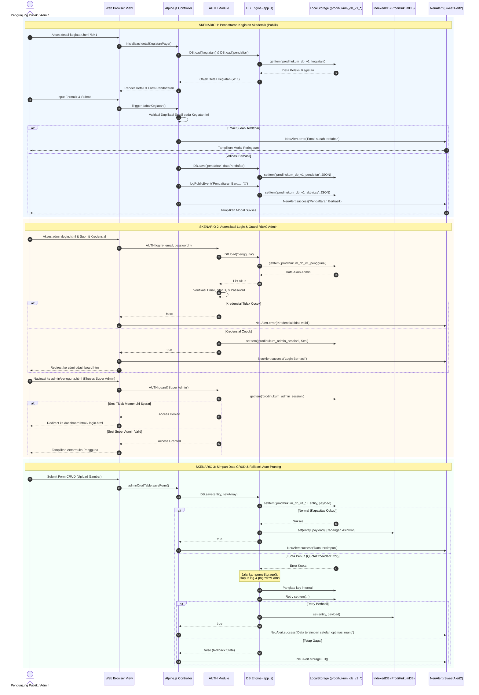
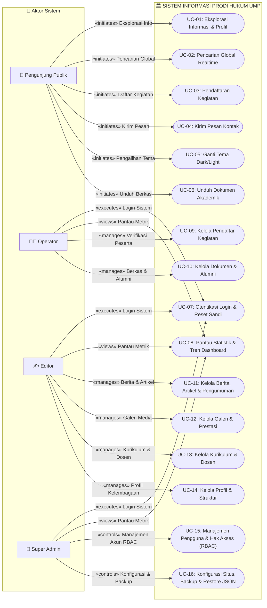
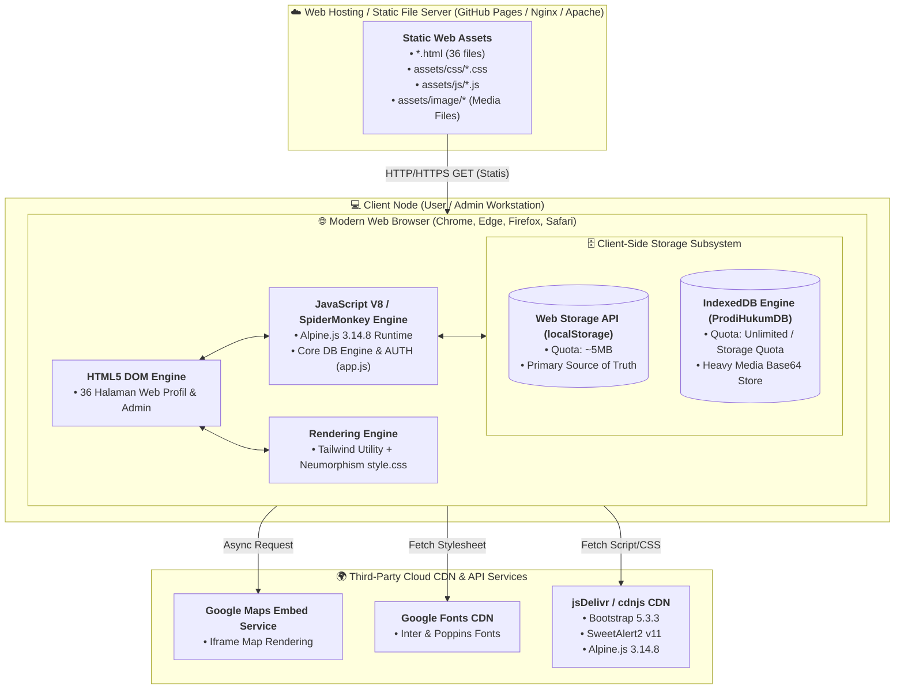

# 🏛️ ANALISA PERANCANGAN SISTEM & KUMPULAN DIAGRAM MERMAID (FINAL)

## Website Profil & Panel Admin Program Studi Hukum — Universitas Muhammadiyah Papua (UMP)

> Dokumen ini adalah **kumpulan lengkap diagram rekayasa perangkat lunak dalam format Mermaid (`.md`) dan analisis perancangan sistem** untuk Website Profil dan Panel Administrasi Program Studi Hukum Universitas Muhammadiyah Papua. Seluruh kode Mermaid di bawah ini diverifikasi 100% konsisten dan akurat terhadap basis kode frontend (`assets/js/app.js`, `assets/css/style.css`, 36 berkas HTML).

---

## 📑 DAFTAR ISI DIAGRAM

1. [1. Data Flow Diagram (DFD) Level 0 — Diagram Konteks](#1-data-flow-diagram-dfd-level-0--diagram-konteks)
2. [2. Data Flow Diagram (DFD) Level 1 — Dekomposisi Proses Utama](#2-data-flow-diagram-dfd-level-1--dekomposisi-proses-utama)
3. [3. Flowchart Sistem — Logika Navigasi Publik & Panel Admin](#3-flowchart-sistem--logika-navigasi-publik--panel-admin)
4. [4. Entity Relationship Diagram (ERD) — 17 Entitas Data](#4-entity-relationship-diagram-erd--17-entitas-data)
5. [5. Component Diagram — Arsitektur 4-Layer Client-Side](#5-component-diagram--arsitektur-4-layer-client-side)
6. [6. Sequence Diagram — 3 Skenario Krusial Transaksi Data](#6-sequence-diagram--3-skenario-krusial-transaksi-data)
7. [7. Use Case Diagram — 4 Aktor & 16 Use Cases](#7-use-case-diagram--4-aktor--16-use-cases)
8. [8. Deployment Diagram — Topologi Fisik & Runtime CDN](#8-deployment-diagram--topologi-fisik--runtime-cdn)
9. [9. Panduan Penggunaan Berkas Draw.io XML](#9-panduan-penggunaan-berkas-drawio-xml)

---

## 1. Data Flow Diagram (DFD) Level 0 — Diagram Konteks

### 1.1 Deskripsi & Batasan Sistem

DFD Level 0 (Diagram Konteks) menggambarkan batas terluar (_system boundary_) dari Sistem Informasi Profil & Panel Admin Program Studi Hukum UMP, memetakan seluruh entitas eksternal (Pengunjung Publik, Sivitas Akademika, Pengguna Admin, serta Layanan Eksternal Cloud CDN & Google Maps API) dan pertukaran aliran data global ke dalam sistem utama.

### 1.2 Kode Mermaid (DFD Level 0)

```mermaid
flowchart TB
    %% ==========================================
    %% 1. PRESENTATION & UI LAYER
    %% ==========================================
    subgraph PRESENTATION["🌐 1. Presentation & Styling Layer (Client Browser)"]
        subgraph PUB_VIEWS["📄 Public View Components (18 Halaman HTML)"]
            PUB_PAGES["<b>Public Pages</b><br/>• index.html, profil.html, dosen.html<br/>• kurikulum.html, berita.html, pengumuman.html<br/>• kegiatan.html, artikel.html, prestasi.html<br/>• alumni.html, galeri.html, dokumen.html, kontak.html"]
            PUB_DETAIL["<b>Detail Views</b><br/>• detail-berita.html, detail-artikel.html<br/>• detail-pengumuman.html, detail-kegiatan.html<br/>• detail-galeri.html"]
        end

        subgraph ADM_VIEWS["🔐 Admin View Components (18 Halaman HTML)"]
            ADM_AUTH["<b>Auth Views</b><br/>• login.html, lupa-sandi.html"]
            ADM_DASH["<b>Dashboard & Config</b><br/>• dashboard.html, pengaturan.html<br/>• profil-prodi.html, aktivitas.html"]
            ADM_CRUD["<b>CRUD Management Views</b><br/>• berita.html, pengumuman.html, kegiatan.html<br/>• artikel.html, prestasi.html, dosen.html<br/>• kurikulum.html, alumni.html, galeri.html<br/>• dokumen.html, pengguna.html"]
        end

        subgraph DESIGN_SYSTEM["🎨 Neumorphism Design System"]
            CSS_TOKENS["<b>style.css</b><br/>• Neumorphic Tokens (--neu-light, --neu-dark)<br/>• Theme Tokens (Light & Dark Mode)<br/>• Component Classes (.neu-raised, .neu-pressed, .neu-btn)"]
            TW_ENGINE["<b>Tailwind CSS 3.4 & Bootstrap 5.3</b><br/>• tailwind.min.css (Utility Classes)<br/>• Responsive Grid Subsystem"]
        end
    end

    %% ==========================================
    %% 2. CONTROLLER & REACTIVE LOGIC LAYER
    %% ==========================================
    subgraph CONTROLLER["⚡ 2. Reactive Controller Layer (Alpine.js Components)"]
        HEADER_CTRL["<b>siteHeader & themeStore</b><br/>• Dark/Light Mode Switcher<br/>• Mobile Drawer Navigation<br/>• syncThemeColorMeta()"]
        SEARCH_CTRL["<b>globalSearch Controller</b><br/>• Realtime Query Filter<br/>• getSearchIndex() Connector"]
        DETAIL_CTRL["<b>Public Detail Controllers</b><br/>• detailBeritaPage(), detailKegiatanPage()<br/>• daftarKegiatan() & Form Pendaftaran<br/>• contactForm() & detailContentPage()"]
        
        ADM_SHELL_CTRL["<b>adminShell Controller</b><br/>• Sesi State & Logout Trigger<br/>• Sidebar Responsive Toggle<br/>• Notifikasi Polling & Badge Counter"]
        ADM_CRUD_CTRL["<b>adminCrudTable & Data Controllers</b><br/>• Generic CRUD Manager (rows, filter, paginate)<br/>• Image Compression Trigger<br/>• adminPenggunaTable() & adminDokumenTable()"]
        ALERT_WRAPPER["<b>NeuAlert (SweetAlert2 Wrapper)</b><br/>• Modal Konfirmasi Hapus & Dialog Sukses<br/>• Alert Quota Storage Penuh (storageFull)"]
    end

    %% ==========================================
    %% 3. BUSINESS LOGIC & PERSISTENCE ENGINE
    %% ==========================================
    subgraph CORE_ENGINE["⚙️ 3. Core Logic & Persistence Engine (assets/js/app.js)"]
        subgraph AUTH_MODULE["🔑 Authentication & Access Control Subsystem"]
            AUTH_CORE["<b>AUTH Engine</b><br/>• AUTH.login(matchedUser)<br/>• AUTH.logout()<br/>• AUTH.current() & AUTH.isLoggedIn()<br/>• AUTH.guard(requiredRole)"]
            RBAC_RULES["<b>Role-Based Access Control (RBAC)</b><br/>• Super Admin: Akses Penuh<br/>• Editor: Kelola Konten & Publikasi<br/>• Operator: Entri Data Terbatas"]
        end

        subgraph DB_ENGINE["🗄️ Database Management Subsystem (DB Engine)"]
            DB_CORE["<b>DB Interface</b><br/>• DB.load(entityKey, seedFallback)<br/>• DB.save(entityKey, payload)<br/>• DB.reset(entityKey) & DB.resetAll()<br/>• DB.optimizeStorage()"]
            PRUNE_SYS["<b>Storage Optimization & Pruning</b><br/>• QuotaExceededError Handler<br/>• pruneStorage() (Pangkas Pageview & Log Lama)<br/>• compressImageFile() (Otomatis Kompres Gambar)"]
            AUDIT_SYS["<b>Audit Trail & Activity Logger</b><br/>• logActivity(aksi, icon)<br/>• logPublicEvent(aksi, icon)"]
        end

        subgraph IDB_MODULE["📦 Unlimited Media Backing Store (IDB Engine)"]
            IDB_CORE["<b>IndexedDB Connector (ProdiHukumDB)</b><br/>• IDB.get(key)<br/>• IDB.set(key, val)<br/>• IDB.clear()"]
        end

        subgraph SEED_REPO["🌱 Seed Fixtures Repository"]
            SEED_DATA["<b>Default Fixtures (16 Entitas)</b><br/>• SEED_BERITA, SEED_DOSEN, SEED_PENGUMUMAN<br/>• SEED_KEGIATAN, SEED_KURIKULUM, SEED_ALUMNI<br/>• SEED_PENGGUNA, SEED_PROFIL, SEED_PENGATURAN, dll."]
        end
    end

    %% ==========================================
    %% 4. STORAGE & EXTERNAL SERVICES LAYER
    %% ==========================================
    subgraph STORAGE_EXT["💾 4. Client Storage & External Integrations"]
        subgraph BROWSER_STORAGE["💽 Local Client Storage Subsystem"]
            LOCAL_STORAGE[("<b>Web Storage API (localStorage)</b><br/>• prodihukum_db_v1_&lt;entity&gt;<br/>• prodihukum_admin_session<br/>• prodihukum_pageviews_v1<br/>• theme (light/dark)")]
            INDEXED_DB[("<b>IndexedDB Storage</b><br/>• DB Name: ProdiHukumDB<br/>• ObjectStore: entities<br/>• Unlimited Media & Blob Storage")]
        end

        subgraph EXT_SERVICES["☁️ External CDN & Web Services"]
            MAPS_API["<b>Google Maps Embed Service</b><br/>• Iframe Peta Lokasi Kampus / Kegiatan"]
            CDN_FONTS["<b>Google Fonts API</b><br/>• Inter (Sans-serif) & Poppins (Display)"]
            CDN_LIBS["<b>JavaScript CDN Providers</b><br/>• Alpine.js 3.14.8, SweetAlert2 v11, Bootstrap 5.3.3"]
        end
    end

    %% ==========================================
    %% INTER-COMPONENT RELATIONSHIPS & DEPENDENCIES
    %% ==========================================
    
    %% Styling Dependencies
    PUB_VIEWS -.-> DESIGN_SYSTEM
    ADM_VIEWS -.-> DESIGN_SYSTEM
    DESIGN_SYSTEM -.-> CDN_FONTS
    DESIGN_SYSTEM -.-> CDN_LIBS

    %% View -> Controller Bindings
    PUB_PAGES --> HEADER_CTRL
    PUB_PAGES --> SEARCH_CTRL
    PUB_DETAIL --> DETAIL_CTRL
    PUB_PAGES -. "Embeds iframe" .-> MAPS_API
    
    ADM_AUTH --> AUTH_CORE
    ADM_DASH --> ADM_SHELL_CTRL
    ADM_CRUD --> ADM_CRUD_CTRL
    ADM_CRUD_CTRL --> ALERT_WRAPPER
    ADM_SHELL_CTRL --> ALERT_WRAPPER

    %% Controller -> Core Logic Dependencies
    HEADER_CTRL -- "Write theme preference" --> LOCAL_STORAGE
    SEARCH_CTRL -- "Request aggregate index" --> DB_CORE
    DETAIL_CTRL -- "Load/Save Data (Pendaftar, dll.)" --> DB_CORE
    DETAIL_CTRL -- "Trigger logPublicEvent()" --> AUDIT_SYS

    ADM_SHELL_CTRL -- "Check session status" --> AUTH_CORE
    ADM_CRUD_CTRL -- "Read / Write Data" --> DB_CORE
    ADM_CRUD_CTRL -- "Trigger logActivity()" --> AUDIT_SYS
    ADM_CRUD_CTRL -- "Request image compression" --> PRUNE_SYS
    ADM_AUTH -- "Submit credentials" --> AUTH_CORE

    %% Core Logic Internal Interactions
    AUTH_CORE -- "Verify role permissions" --> RBAC_RULES
    AUTH_CORE -- "Read user list ('pengguna')" --> DB_CORE
    AUTH_CORE -- "Write/Delete prodihukum_admin_session" --> LOCAL_STORAGE
    
    DB_CORE -- "Initial load if store empty" --> SEED_DATA
    DB_CORE -- "Auto-invoke on QuotaExceeded" --> PRUNE_SYS
    DB_CORE -- "Primary synchronous I/O (prodihukum_db_v1_*)" --> LOCAL_STORAGE
    DB_CORE -- "Async backup storage" --> IDB_CORE
    IDB_CORE -- "Store heavy media / base64" --> INDEXED_DB

    AUDIT_SYS -- "Persist audit trail ('aktivitas' & 'notifikasi')" --> DB_CORE
    PRUNE_SYS -- "Prune old logs & pageviews" --> LOCAL_STORAGE
```

---

## 2. Data Flow Diagram (DFD) Level 1 — Dekomposisi Proses Utama

### 2.1 Deskripsi Proses & Media Penyimpanan

DFD Level 1 membedah proses utama `0.0` menjadi **10 Sub-Proses Fungsional** dan menghubungkannya dengan **17 Data Store** berbasis `localStorage` yang terisolasi _namespace_ `prodihukum_db_v1_<entity>` serta cadangan asinkron `IndexedDB (ProdiHukumDB)`.

### 2.2 Kode Mermaid (DFD Level 1)

```mermaid
flowchart TB
    subgraph ENTITAS["👥 Entitas Eksternal"]
        P["👤 Pengunjung Publik"]
        A["🔐 Admin (Super Admin / Editor / Operator)"]
    end

    subgraph PROSES["⚙️ Proses Sistem (Level 1)"]
        P1["1.0<br/>Manajemen Tampilan Konten Publik"]
        P2["2.0<br/>Pencarian Global Realtime"]
        P3["3.0<br/>Pendaftaran Kegiatan Akademik"]
        P4["4.0<br/>Pengiriman Formulir Kontak"]
        P5["5.0<br/>Autentikasi & Guard RBAC"]
        P6["6.0<br/>Manajemen Konten CRUD (11 Modul)"]
        P7["7.0<br/>Manajemen Akun Pengguna & Peran"]
        P8["8.0<br/>Pencatatan Audit Trail & Notifikasi"]
        P9["9.0<br/>Pengaturan Situs & Backup / Restore"]
        P10["10.0<br/>Agregasi Statistik & Tren Dashboard"]
    end

    subgraph DATASTORES["🗄️ Data Store (localStorage & IndexedDB)"]
        DS1[("D1 · berita")]
        DS2[("D2 · dosen")]
        DS3[("D3 · dokumen")]
        DS4[("D4 · galeri")]
        DS5[("D5 · pengumuman")]
        DS6[("D6 · kegiatan")]
        DS7[("D7 · pendaftar")]
        DS8[("D8 · artikel")]
        DS9[("D9 · prestasi")]
        DS10[("D10 · kurikulum")]
        DS11[("D11 · alumni")]
        DS12[("D12 · pengguna")]
        DS13[("D13 · aktivitas")]
        DS14[("D14 · notifikasi")]
        DS15[("D15 · profil & struktur")]
        DS16[("D16 · pengaturan")]
        DSPV[("PV · prodihukum_pageviews_v1")]
    end

    P -- "Akses Halaman & Filter Kategori" --> P1
    P1 -- "Read Data" --> DS1 & DS2 & DS3 & DS4 & DS5 & DS6 & DS8 & DS9 & DS10 & DS11 & DS15 & DS16
    P1 -- "Write Hit (trackPageView)" --> DSPV
    P1 -- "Render Halaman / Detail" --> P

    P -- "Input Kueri Pencarian" --> P2
    P2 -- "Read Index Gabungan" --> DS1 & DS2 & DS3 & DS5 & DS6 & DS8 & DS9 & DS10 & DS11
    P2 -- "Daftar Hasil Pencarian" --> P

    P -- "Submit Data Pendaftar" --> P3
    P3 -- "Write Data Peserta" --> DS7
    P3 -- "Trigger Log Publik" --> P8
    P3 -- "Konfirmasi Sukses" --> P

    P -- "Submit Pesan" --> P4
    P4 -- "Validasi & Feedback" --> P

    A -- "Input Email & Password" --> P5
    P5 -- "Read Kredensial" --> DS12
    P5 -- "Set Sesi Admin & Guard" --> A

    A -- "Create / Update / Delete" --> P6
    P6 -- "Write Data Koleksi" --> DS1 & DS2 & DS3 & DS4 & DS5 & DS6 & DS8 & DS9 & DS10 & DS11 & DS15
    P6 -- "Catat Aksi Admin" --> P8

    A -- "Kelola Akun (Super Admin)" --> P7
    P7 -- "Write Akun Admin" --> DS12
    P7 -- "Catat Aksi Admin" --> P8

    P8 -- "Write Log" --> DS13
    P8 -- "Write Notif" --> DS14

    A -- "Ubah Identitas / Backup / Reset" --> P9
    P9 -- "Write Pengaturan" --> DS15 & DS16
    P9 -- "Catat Aksi Admin" --> P8

    A -- "Akses Dashboard" --> P10
    P10 -- "Hitung Metrik & Tren" --> DS1 & DS2 & DS11 & DS12 & DSPV & DS13
    P10 -- "Render Widget Statistik" --> A
```

---

## 3. Flowchart Sistem — Logika Navigasi Publik & Panel Admin

### 3.1 Deskripsi Alur Logika

Flowchart Sistem membagi alur logika menjadi dua modul terpisah:

1. **Alur Pengunjung Publik**: Membuka landing page, navigasi konten, pencarian instan, pengisian form registrasi kegiatan dengan validasi anti-duplikasi email, unduh dokumen, dan pergantian tema mode gelap/terang.
2. **Alur Panel Administrasi**: Pengecekan sesi login, validasi otentikasi kredensial pengguna, otorisasi RBAC guard (Super Admin vs Editor vs Operator), eksekusi transaksi CRUD, pencatatan otomatis jejak audit log (`logActivity`), dan pemutusan sesi (_logout_).

### 3.2 Kode Mermaid (Flowchart Sistem)

```mermaid
flowchart TD
    %% SUB-FLOW 1: PENGUNJUNG PUBLIK
    subgraph PUBLIC_FLOW["🌐 ALUR INTERAKSI PENGUNJUNG PUBLIK"]
        P_Start([Mulai: Pengunjung Buka Website]) -->|Inisialisasi Aplikasi| P_Choice{Pilih Menu / Fitur}

        P_Choice -->|1. Akses Informasi| P_Load[Muat Data dari LocalStorage & IndexedDB]
        P_Load -->|Koleksi Dimuat| P_PV[Catat Pageview Harian otomatis]
        P_PV -->|Hit Tercatat| P_Render[Render Tampilan Responsif & Interaktif]

        P_Choice -->|2. Pencarian Global| P_Search[/Input Kata Kunci/]
        P_Search -->|Kueri Dikirim| P_ExecSearch[Cari pada Indeks 9 Entitas Data]
        P_ExecSearch -->|Hasil Ditemukan| P_RenderSearch[Tampilkan Hasil & Tautan Langsung]

        P_Choice -->|3. Pendaftaran Kegiatan| P_OpenKeg[Buka detail-kegiatan.html?id=...]
        P_OpenKeg -->|Submit Form Event| P_FillKeg[/Isi Formulir Pendaftaran/]
        P_FillKeg -->|Cek Duplikasi| P_ValEmail{Email Sudah Terdaftar?}
        P_ValEmail -- Ya (Duplikat) --> P_ErrEmail[Tampilkan SweetAlert Error]
        P_ValEmail -- Tidak (Valid) --> P_SaveKeg[Simpan ke 'pendaftar' & Catat Log]
        P_SaveKeg -->|Commit Berhasil| P_OkKeg[Tampilkan SweetAlert Sukses]

        P_Choice -->|4. Ganti Tema| P_ToggleDark[Klik Tombol Mode Gelap/Terang]
        P_ToggleDark -->|Simpan Preferensi| P_ApplyTheme[Toggle Class .dark & Simpan ke localStorage]

        P_Render -->|Navigasi Selesai| P_End([Selesai])
        P_RenderSearch -->|Buka Detail Konten| P_End
        P_ErrEmail -->|Tutup Alert Error| P_End
        P_OkKeg -->|Unduh Tiket PDF| P_End
        P_ApplyTheme -->|Terapkan Tema Baru| P_End
    end

    %% SUB-FLOW 2: PANEL ADMINISTRASI
    subgraph ADMIN_FLOW["🔐 ALUR AUTENTIKASI & KONTROL AKSES (RBAC) ADMIN"]
        A_Start([Mulai: Buka Panel Admin]) -->|Akses URL /admin/*| A_CheckLogin{Halaman Login?}

        A_CheckLogin -- Ya (Halaman Login) --> A_HasSession{Ada Sesi Aktif?}
        A_HasSession -- Ya (Sesi Valid) --> A_DirectDash[Redirect ke dashboard.html]
        A_HasSession -- Tidak (Belum Login) --> A_ShowForm[Tampilkan Form Login]
        A_ShowForm -->|Kirim Kredensial| A_SubmitCreds[/Input Email & Password/]
        A_SubmitCreds -->|Validasi Hash SHA-256| A_VerifyAcc{Verifikasi Kredensial & Status}
        A_VerifyAcc -- Gagal / Nonaktif --> A_AlertFail[SweetAlert: Kredensial Tidak Valid]
        A_AlertFail -->|Ulangi Login| A_ShowForm
        A_VerifyAcc -- Sukses --> A_CreateSession[Simpan Sesi ke prodihukum_admin_session]
        A_CreateSession -->|Masuk Dashboard| A_DirectDash

        A_CheckLogin -- Tidak (Halaman CRUD/Modul) --> A_RunGuard["Eksekusi AUTH.guard()"]
        A_RunGuard -->|Periksa sessionStorage| A_CheckAuth{Sesi Valid?}
        A_CheckAuth -- Tidak (Tidak Ada Sesi) --> A_RedirectLogin[Redirect ke login.html]
        A_CheckAuth -- Ya (Terotentikasi) --> A_CheckRole{Halaman Khusus Super Admin?}

        A_CheckRole -- Ya (pengguna/pengaturan) --> A_IsSuper{Role === 'Super Admin'?}
        A_IsSuper -- Tidak (Hak Ditolak) --> A_DenyAlert[SweetAlert: Hak Akses Ditolak]
        A_DenyAlert -->|Kembali ke Dashboard| A_DirectDash
        A_IsSuper -- Ya (Otorisasi Penuh) --> A_AllowSuper[Buka Manajemen Pengguna/Pengaturan]

        A_CheckRole -- Tidak (Modul CRUD Umum) --> A_AllowGeneral[Buka Modul CRUD Sesuai Role]

        A_AllowSuper -->|Akses Penuh Super Admin| A_ExecCRUD[Operasi: Tambah / Edit / Hapus / Backup]
        A_AllowGeneral -->|Akses Terbatas Editor/Operator| A_ExecCRUD
        A_ExecCRUD -->|Commit Transaksi| A_SaveData[Simpan ke LocalStorage & Cadangkan ke IDB]
        A_SaveData -->|Trigger Audit Trail| A_WriteLog[Pencatatan Otomatis Log Audit]
        A_WriteLog -->|Perbarui Tampilan| A_RefreshTable[Pembaruan Tabel Reaktif]

        A_DirectDash -->|Sesi Berjalan| A_End([Selesai])
        A_RedirectLogin -->|Kembali ke Login| A_End
        A_RefreshTable -->|Operasi Selesai| A_End
    end
```

---

## 4. Entity Relationship Diagram (ERD) — 17 Entitas Data

### 4.1 Deskripsi Struktur Skema & Relasi

ERD mendefinisikan 17 model data entitas secara lengkap beserta atribut tipe data, primary key, dan foreign key:

- **Relasi Utama**: `KEGIATAN (1) ──── (N) PENDAFTAR` melalui kunci tamu `PENDAFTAR.kegiatanId`.
- **Relasi Jejak Audit**: `PENGGUNA (1) ──── (N) AKTIVITAS` melalui field `AKTIVITAS.user`.
- **Relasi Notifikasi**: `PENGGUNA (1) ──── (N) NOTIFIKASI`.

### 4.2 Kode Mermaid (ERD)

```mermaid
erDiagram
    KEGIATAN ||--o{ PENDAFTAR : "memiliki pendaftar (kegiatanId)"
    KEGIATAN ||--o{ GALERI : "dokumentasi kegiatan"
    PENGGUNA ||--o{ AKTIVITAS : "mencatat log aktivitas (user)"
    PENGGUNA ||--o{ NOTIFIKASI : "menerima notifikasi"
    PENGGUNA ||--o{ BERITA : "menerbitkan warta (penulis)"
    PENGGUNA ||--o{ ARTIKEL : "membuat publikasi (penulis)"
    PENGGUNA ||--o{ PENGUMUMAN : "merilis pengumuman"
    PENGGUNA ||--o{ DOKUMEN : "mengunggah dokumen"
    PROFIL ||--|{ STRUKTUR : "memiliki struktur organisasi"
    DOSEN ||--o| STRUKTUR : "penugasan jabatan struktural"
    DOSEN ||--o{ KURIKULUM : "dosen pengampu matakuliah"
    DOSEN ||--o{ PRESTASI : "penghargaan dosen"
    ALUMNI ||--o{ PRESTASI : "rekam jejak prestasi"
    PROFIL ||--|| PENGATURAN : "konfigurasi situs & prodi"
    PROFIL ||--|{ DOKUMEN : "dokumen SK & akreditasi"
    PROFIL ||--|{ KURIKULUM : "struktur kurikulum prodi"

    BERITA {
        int id PK
        string slug
        string judul
        string kategori
        string tanggal
        string penulis FK "Mereferensi PENGGUNA.nama"
        string excerpt
        string konten
        string status "Draft | Review | Published"
        bool featured
        string gambar "Path / Base64"
    }

    DOSEN {
        int id PK
        string nama
        string jabatan
        string keahlian
        string pendidikan
        string email
        string nidn
        string profil
        string status "Aktif | Cuti | Tugas Belajar"
        string foto "Path / Base64"
    }

    DOKUMEN {
        int id PK
        string nama
        string kategori "Kurikulum | Panduan | SK | Formulir"
        string format "PDF | DOCX | XLS"
        string ukuran
        int tahun
        string fileUrl
        int downloads
    }

    GALERI {
        int id PK
        string judul
        string album "Seminar | Kuliah Umum | Praktikum | Wisuda | dll"
        string src "Path / Base64"
        string tanggal
    }

    PENGUMUMAN {
        int id PK
        string judul
        string status "Penting | Baru | Aktif | Berakhir"
        string badge "badge-important | badge-new | badge-active"
        string tanggal
        string isi
        string lampiran
    }

    KEGIATAN {
        int id PK
        string nama
        string tanggal
        string hari
        string bulan
        string waktu
        string lokasi
        string penyelenggara
        string deskripsi
        string gambar "Path / Base64"
    }

    PENDAFTAR {
        int id PK
        int kegiatanId FK "Mereferensi KEGIATAN.id"
        string kegiatanNama
        string nama
        string email
        string whatsapp
        string instansi
        string waktuDaftar
    }

    ARTIKEL {
        int id PK
        string judul
        string penulis FK "Mereferensi PENGGUNA / DOSEN"
        string kategori "Hukum Pidana | Tata Negara | Adat | Bisnis"
        string tanggal
        string isi
        string referensi
        string tags
        string status "Draft | Review | Published"
        string thumbnail "Path / Base64"
    }

    PRESTASI {
        int id PK
        string nama
        string kategori "Mahasiswa | Dosen | Alumni | Program Studi"
        string tingkat "Provinsi | Regional | Nasional | Internasional"
        string tahun
        string foto "Path / Base64"
    }

    KURIKULUM {
        int id PK
        string kode
        string nama
        int sks
        string jenis "Wajib | Pilihan"
        int semester
        string silabusUrl
        string deskripsi
    }

    ALUMNI {
        int id PK
        string nama
        string angkatan
        string pekerjaan
        string instansi
        string kategori "Bekerja | Studi Lanjut | Wirausaha"
        string email
        string linkedin
        string status "Terverifikasi | Menunggu"
        string foto "Path / Base64"
    }

    PENGGUNA {
        int id PK
        string nama
        string email
        string password
        string role "Super Admin | Editor | Operator"
        string status "Aktif | Nonaktif"
    }

    AKTIVITAS {
        int id PK
        string user FK "Mereferensi PENGGUNA.nama"
        string aksi
        string waktu
        string tanggalIso
        string icon
    }

    NOTIFIKASI {
        int id PK
        string judul
        string pesan
        string waktu
        bool read
        string icon
    }

    PROFIL {
        string nama
        string kode
        string fakultas
        string universitas
        string akreditasi
        string deskripsi
        string sejarah
        string visi
        string misi
        string tujuan
        string lulusan
    }

    STRUKTUR {
        int id PK
        string nama
        string jabatan
        string foto
    }

    PENGATURAN {
        string namaWebsite
        string deskripsi
        string logo
        string favicon
        string theme
        string primaryColor
        bool darkMode
        string metaTitle
        string metaDesc
        string keywords
        string email
        string telepon
        string alamat
        string mapEmbed
        string mapLink
        string koordinat
        int mahasiswaAktif
    }
```

---

## 5. Component Diagram — Arsitektur 4-Layer Client-Side

### 5.1 Deskripsi Lapisan Perangkat Lunak

Sistem dirancang dengan arsitektur 4-Layer murni di sisi peramban (_client-side_):

1. **Presentation & Styling Layer**: 36 berkas HTML (18 Publik + 18 Admin), Neumorphism Design System (`style.css`), Tailwind CSS 3.4, dan Bootstrap 5.3.3.
2. **Reactive Controller Layer**: Alpine.js komponen (`siteHeader`, `globalSearch`, `detailKegiatanPage`, `adminCrudTable`, `adminShell`, `NeuAlert`).
3. **Core Engine & Business Logic Layer**: `AUTH` module, `DB` engine interface, `IDB` IndexedDB module, `SEED_*` data fixtures, auto-pruning memory manager, dan activity logging engine.
4. **Storage & External Services Layer**: Web Storage API (`localStorage`), IndexedDB (`ProdiHukumDB`), Google Maps Embed API, Google Fonts, dan CDN Providers.

### 5.2 Kode Mermaid (Component Diagram)

---

## 6. Sequence Diagram — 3 Skenario Krusial Transaksi Data

### 6.1 Deskripsi Skenario Urutan Pesan

Sequence diagram memodelkan urutan interaksi objek (_lifelines_) pada 3 skenario inti:

1. **Skenario 1**: Registrasi Kegiatan Seminar oleh Pengunjung Publik (validasi duplikasi email & pencatatan peserta).
2. **Skenario 2**: Autentikasi Login Admin & Validasi Hak Akses RBAC Guard (`AUTH.guard`).
3. **Skenario 3**: Transaksi CRUD Penyimpanan Gambar & Penanganan Otomatis Kuota Penuh (_Auto-Pruning Storage_).

### 6.2 Kode Mermaid (Sequence Diagram)

---

## 7. Use Case Diagram — 4 Aktor & 16 Use Cases

### 7.1 Pemetaan Aktor & Hak Akses

- **Pengunjung Publik**: Menjalankan UC-01 sampai UC-06 (Eksplorasi Profil, Berita, Dosen, Dokumen, Registrasi Kegiatan, dan Ganti Tema).
- **Operator**: Mengelola UC-07 sampai UC-10 (Login, Dashboard, Kelola Pendaftar, Dokumen & Alumni).
- **Editor**: Mengelola UC-07 sampai UC-12 (Menambah Berita, Artikel, Pengumuman, Galeri, Prestasi, Kurikulum, dan Dosen).
- **Super Admin**: Memiliki hak akses penuh ke seluruh 16 Use Case, termasuk UC-15 (Manajemen Pengguna & RBAC) serta UC-16 (Konfigurasi Sistem, Reset & Backup/Restore JSON).

### 7.2 Kode Mermaid (Use Case Diagram)

---

## 8. Deployment Diagram — Topologi Fisik & Runtime CDN

### 8.1 Arsitektur Komputasi & Jaringan

Sistem beroperasi di bawah model _Jamstack / Static Hosting_ modern:

1. **Client Node (Workstation/Mobile)**: Menjalankan Modern Web Browser (DOM Engine HTML5 + CSS + V8 JS Engine Alpine.js & Core DB Engine `app.js`).
2. **Static Web Server**: Melayani 36 berkas HTML dan folder aset statis (`assets/css/`, `assets/js/`, `assets/image/`).
3. **Cloud CDN Services**: Menyediakan library JavaScript dan Font global (Tailwind, Alpine.js, SweetAlert2, Google Fonts).

### 8.2 Kode Mermaid (Deployment Diagram)

---

## 9. Panduan Penggunaan Berkas Draw.io XML

Untuk mengedit atau membuka diagram di aplikasi **[draw.io (diagrams.net)](https://app.diagrams.net)**, gunakan berkas XML yang telah disediakan di folder [`docs/diagrams/drawio/`](docs/diagrams/drawio/):

| Nama Diagram                     | Berkas XML Draw.io                                                                                         | Tipe & Kapasitas         |
| -------------------------------- | ---------------------------------------------------------------------------------------------------------- | ------------------------ |
| **DFD Level 0**                  | [`docs/diagrams/drawio/dfd-level-0.drawio.xml`](docs/diagrams/drawio/dfd-level-0.drawio.xml)               | `.drawio.xml` (7,4 KB)   |
| **DFD Level 1**                  | [`docs/diagrams/drawio/dfd-level-1.drawio.xml`](docs/diagrams/drawio/dfd-level-1.drawio.xml)               | `.drawio.xml` (15,4 KB)  |
| **Flowchart Sistem**             | [`docs/diagrams/drawio/flowchart-sistem.drawio.xml`](docs/diagrams/drawio/flowchart-sistem.drawio.xml)     | `.drawio.xml` (12,0 KB)  |
| **ER Diagram (17 Entitas)**      | [`docs/diagrams/drawio/er-diagram.drawio.xml`](docs/diagrams/drawio/er-diagram.drawio.xml)                 | `.drawio.xml` (37,1 KB)  |
| **Component Diagram**            | [`docs/diagrams/drawio/component-diagram.drawio.xml`](docs/diagrams/drawio/component-diagram.drawio.xml)   | `.drawio.xml` (8,8 KB)   |
| **Sequence Diagram**             | [`docs/diagrams/drawio/sequence-diagram.drawio.xml`](docs/diagrams/drawio/sequence-diagram.drawio.xml)     | `.drawio.xml` (12,2 KB)  |
| **Use Case Diagram**             | [`docs/diagrams/drawio/usecase-diagram.drawio.xml`](docs/diagrams/drawio/usecase-diagram.drawio.xml)       | `.drawio.xml` (12,2 KB)  |
| **Deployment Diagram**           | [`docs/diagrams/drawio/deployment-diagram.drawio.xml`](docs/diagrams/drawio/deployment-diagram.drawio.xml) | `.drawio.xml` (7,6 KB)   |
| **Master Semua Diagram (8 Tab)** | [`docs/diagrams/drawio/all-diagrams.drawio.xml`](docs/diagrams/drawio/all-diagrams.drawio.xml)             | `.drawio.xml` (111,7 KB) |

### Cara Buka di Draw.io:

1. **Opsi 1 (File)**: Buka [app.diagrams.net](https://app.diagrams.net) ➔ Pilih **"Open Existing Diagram"** ➔ Pilih file `.drawio.xml`.
2. **Opsi 2 (Copy-Paste)**: Buka file `.drawio.xml` di VS Code ➔ Salin (Ctrl+A, Ctrl+C) ➔ Di draw.io klik menu **Extras** ➔ **Edit Diagram...** ➔ Tempel (Ctrl+V) ➔ Klik **Apply**.
3. **Opsi 3 (Viewer Interaktif)**: Buka [`preview.html`](preview.html) di peramban ➔ Klik tombol **"📋 Salin Draw.io XML"** ➔ Tempel di draw.io.
